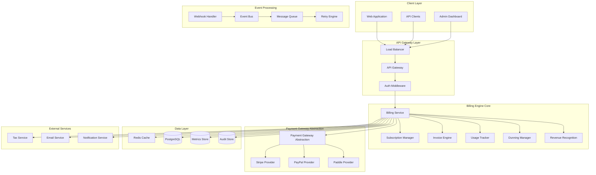

# Billing & Subscription Engine Design

## Overview

This design document outlines the architecture for implementing a comprehensive billing and subscription management engine that supports multiple payment providers, subscription lifecycle management, usage-based billing, invoice generation, webhook handling, dunning management, and revenue recognition. The design integrates with the existing workspace-based multi-tenancy architecture and provides enterprise-grade billing capabilities for SaaS applications.

## Architecture

### High-Level Architecture



### Multi-Tenancy Architecture

The billing system implements workspace-based multi-tenancy with the following isolation mechanisms:

1. **Data Isolation**: Workspace discriminator in all billing entities
2. **Payment Isolation**: Workspace-scoped payment methods and subscriptions
3. **Configuration Isolation**: Per-workspace billing policies and tax settings
4. **Revenue Isolation**: Workspace-specific revenue recognition and reporting

## Components and Interfaces

### 1. Payment Gateway Abstraction Layer

#### Core Payment Provider Interface

```kotlin
interface PaymentProvider {
    suspend fun createCustomer(request: CreateCustomerRequest): CustomerResult
    suspend fun createSubscription(request: CreateSubscriptionRequest): SubscriptionResult
    suspend fun updateSubscription(request: UpdateSubscriptionRequest): SubscriptionResult
    suspend fun cancelSubscription(subscriptionId: String, reason: CancellationReason): CancellationResult
    suspend fun createPaymentMethod(request: CreatePaymentMethodRequest): PaymentMethodResult
    suspend fun chargeCustomer(request: ChargeRequest): ChargeResult
    suspend fun refundCharge(chargeId: String, amount: Money?): RefundResult
    suspend fun handleWebhook(payload: String, signature: String): WebhookEventResult
    suspend fun getSubscription(subscriptionId: String): SubscriptionResult
    suspend fun getInvoice(invoiceId: String): InvoiceResult
}
```

#### Payment Gateway Manager

```kotlin
@Service
class PaymentGatewayManager(
    private val providers: Map<ProviderType, PaymentProvider>,
    private val configurationService: BillingConfigurationService
) {

    suspend fun getProvider(workspaceId: WorkspaceId): PaymentProvider {
        val config = configurationService.getBillingConfiguration(workspaceId)
        return providers[config.primaryProvider]
            ?: throw UnsupportedProviderException("Provider ${config.primaryProvider} not available")
    }

    suspend fun getProviderForSubscription(subscriptionId: SubscriptionId): PaymentProvider {
        val subscription = subscriptionService.getSubscription(subscriptionId)
        return providers[subscription.providerType]
            ?: throw UnsupportedProviderException("Provider ${subscription.providerType} not available")
    }
}
```

#### Provider-Specific Implementations

**Stripe Provider Implementation**

```kotlin
@Component
class StripePaymentProvider(
    private val stripeClient: StripeClient,
    private val mapper: StripeDataMapper
) : PaymentProvider {

    override suspend fun createSubscription(request: CreateSubscriptionRequest): SubscriptionResult {
        val stripeRequest = mapper.toStripeSubscriptionRequest(request)
        val stripeSubscription = stripeClient.subscriptions().create(stripeRequest)
        return mapper.fromStripeSubscription(stripeSubscription)
    }

    override suspend fun handleWebhook(payload: String, signature: String): WebhookEventResult {
        val event = Webhook.constructEvent(payload, signature, webhookSecret)
        return when (event.type) {
            "invoice.payment_succeeded" -> handlePaymentSucceeded(event)
            "invoice.payment_failed" -> handlePaymentFailed(event)
            "customer.subscription.updated" -> handleSubscriptionUpdated(event)
            else -> WebhookEventResult.ignored(event.type)
        }
    }
}
```

**PayPal Provider Implementation**

```kotlin
@Component
class PayPalPaymentProvider(
    private val paypalClient: PayPalClient,
    private val mapper: PayPalDataMapper
) : PaymentProvider {

    override suspend fun createSubscription(request: CreateSubscriptionRequest): SubscriptionResult {
        val paypalRequest = mapper.toPayPalSubscriptionRequest(request)
        val paypalSubscription = paypalClient.subscriptions().create(paypalRequest)
        return mapper.fromPayPalSubscription(paypalSubscription)
    }
}
```

**Paddle Provider Implementation**

```kotlin
@Component
class PaddlePaymentProvider(
    private val paddleClient: PaddleClient,
    private val mapper: PaddleDataMapper
) : PaymentProvider {

    override suspend fun createSubscription(request: CreateSubscriptionRequest): SubscriptionResult {
        val paddleRequest = mapper.toPaddleSubscriptionRequest(request)
        val paddleSubscription = paddleClient.subscriptions().create(paddleRequest)
        return mapper.fromPaddleSubscription(paddleSubscription)
    }
}
```

### 2. Subscription Management System

#### Subscription Domain Model

```kotlin
data class Subscription(
    override val id: SubscriptionId,
    val workspaceId: WorkspaceId,
    val customerId: CustomerId,
    val planId: PlanId,
    val status: SubscriptionStatus,
    val providerType: ProviderType,
    val providerSubscriptionId: String,
    val currentPeriodStart: Instant,
    val currentPeriodEnd: Instant,
    val trialStart: Instant?,
    val trialEnd: Instant?,
    val cancelledAt: Instant?,
    val cancelAtPeriodEnd: Boolean,
    val billingCycleAnchor: Instant,
    val quantity: Int,
    val unitAmount: Money,
    val taxRate: BigDecimal?,
    val discountAmount: Money?,
    val metadata: Map<String, String>,
    override val createdAt: LocalDateTime,
    override val createdBy: String,
    override var updatedAt: LocalDateTime?,
    override var updatedBy: String?
) : AggregateRoot<SubscriptionId>()

enum class SubscriptionStatus {
    TRIALING,
    ACTIVE,
    PAST_DUE,
    CANCELLED,
    UNPAID,
    PAUSED,
    INCOMPLETE,
    INCOMPLETE_EXPIRED
}
```

#### Subscription Manager Interface

```kotlin
interface SubscriptionManager {
    suspend fun createSubscription(request: CreateSubscriptionRequest): SubscriptionResult
    suspend fun updateSubscription(subscriptionId: SubscriptionId, request: UpdateSubscriptionRequest): SubscriptionResult
    suspend fun cancelSubscription(subscriptionId: SubscriptionId, reason: CancellationReason): CancellationResult
    suspend fun pauseSubscription(subscriptionId: SubscriptionId, resumeAt: Instant?): PauseResult
    suspend fun resumeSubscription(subscriptionId: SubscriptionId): ResumeResult
    suspend fun changeSubscriptionPlan(subscriptionId: SubscriptionId, newPlanId: PlanId, prorationBehavior: ProrationBehavior): PlanChangeResult
    suspend fun getSubscription(subscriptionId: SubscriptionId): Subscription
    suspend fun getWorkspaceSubscriptions(workspaceId: WorkspaceId): List<Subscription>
    suspend fun processSubscriptionRenewal(subscriptionId: SubscriptionId): RenewalResult
}
```

#### Subscription Plan Management

```kotlin
data class SubscriptionPlan(
    override val id: PlanId,
    val workspaceId: WorkspaceId,
    val name: String,
    val description: String?,
    val billingInterval: BillingInterval,
    val intervalCount: Int,
    val amount: Money,
    val currency: Currency,
    val trialPeriodDays: Int?,
    val usageLimits: Map<String, UsageLimit>,
    val features: Set<String>,
    val isActive: Boolean,
    val metadata: Map<String, String>,
    override val createdAt: LocalDateTime,
    override val createdBy: String,
    override var updatedAt: LocalDateTime?,
    override var updatedBy: String?
) : AggregateRoot<PlanId>()

enum class BillingInterval {
    DAY, WEEK, MONTH, YEAR
}

data class UsageLimit(
    val metricName: String,
    val limit: Long,
    val overageRate: Money?
)
```

### 3. Usage-Based Billing and Metering

#### Usage Tracking System

```kotlin
interface UsageTracker {
    suspend fun recordUsage(event: UsageEvent): UsageRecordResult
    suspend fun getUsage(workspaceId: WorkspaceId, period: BillingPeriod): UsageSummary
    suspend fun getUsageByMetric(workspaceId: WorkspaceId, metricName: String, period: BillingPeriod): List<UsageRecord>
    suspend fun calculateUsageCharges(subscriptionId: SubscriptionId, period: BillingPeriod): UsageCharges
    suspend fun resetUsage(workspaceId: WorkspaceId, metricName: String): ResetResult
}

data class UsageEvent(
    val workspaceId: WorkspaceId,
    val subscriptionId: SubscriptionId?,
    val metricName: String,
    val quantity: Long,
    val timestamp: Instant,
    val properties: Map<String, Any>,
    val idempotencyKey: String
)

data class UsageRecord(
    val id: UsageRecordId,
    val workspaceId: WorkspaceId,
    val subscriptionId: SubscriptionId?,
    val metricName: String,
    val quantity: Long,
    val aggregatedQuantity: Long,
    val timestamp: Instant,
    val billingPeriod: BillingPeriod,
    val properties: Map<String, Any>
)
```

#### Metering and Aggregation Engine

```kotlin
@Service
class MeteringEngine(
    private val usageRepository: UsageRepository,
    private val aggregationService: UsageAggregationService,
    private val pricingEngine: PricingEngine
) {

    suspend fun processUsageEvent(event: UsageEvent): UsageRecordResult {
        // Idempotency check
        val existingRecord = usageRepository.findByIdempotencyKey(event.idempotencyKey)
        if (existingRecord != null) {
            return UsageRecordResult.success(existingRecord)
        }

        // Create usage record
        val usageRecord = UsageRecord(
            id = UsageRecordId.generate(),
            workspaceId = event.workspaceId,
            subscriptionId = event.subscriptionId,
            metricName = event.metricName,
            quantity = event.quantity,
            aggregatedQuantity = 0, // Will be calculated during aggregation
            timestamp = event.timestamp,
            billingPeriod = calculateBillingPeriod(event.timestamp),
            properties = event.properties
        )

        // Store and aggregate
        val savedRecord = usageRepository.save(usageRecord)
        aggregationService.updateAggregations(savedRecord)

        return UsageRecordResult.success(savedRecord)
    }

    suspend fun calculateUsageCharges(subscriptionId: SubscriptionId, period: BillingPeriod): UsageCharges {
        val subscription = subscriptionService.getSubscription(subscriptionId)
        val plan = planService.getPlan(subscription.planId)
        val usage = getUsageForPeriod(subscriptionId, period)

        return pricingEngine.calculateCharges(plan, usage)
    }
}
```

### 4. Invoice Generation and Management

#### Invoice Domain Model

```kotlin
data class Invoice(
    override val id: InvoiceId,
    val workspaceId: WorkspaceId,
    val customerId: CustomerId,
    val subscriptionId: SubscriptionId?,
    val number: String,
    val status: InvoiceStatus,
    val currency: Currency,
    val subtotal: Money,
    val taxAmount: Money,
    val discountAmount: Money,
    val total: Money,
    val amountPaid: Money,
    val amountDue: Money,
    val periodStart: Instant,
    val periodEnd: Instant,
    val dueDate: Instant,
    val paidAt: Instant?,
    val lineItems: List<InvoiceLineItem>,
    val taxLines: List<TaxLine>,
    val discountLines: List<DiscountLine>,
    val metadata: Map<String, String>,
    val providerInvoiceId: String?,
    override val createdAt: LocalDateTime,
    override val createdBy: String,
    override var updatedAt: LocalDateTime?,
    override var updatedBy: String?
) : AggregateRoot<InvoiceId>()

enum class InvoiceStatus {
    DRAFT, OPEN, PAID, VOID, UNCOLLECTIBLE
}

data class InvoiceLineItem(
    val id: LineItemId,
    val description: String,
    val quantity: Long,
    val unitAmount: Money,
    val amount: Money,
    val type: LineItemType,
    val period: BillingPeriod?,
    val metadata: Map<String, String>
)

enum class LineItemType {
    SUBSCRIPTION, USAGE, ONE_TIME, DISCOUNT, TAX
}
```

#### Invoice Engine

```kotlin
interface InvoiceEngine {
    suspend fun generateInvoice(request: GenerateInvoiceRequest): InvoiceResult
    suspend fun finalizeInvoice(invoiceId: InvoiceId): InvoiceResult
    suspend fun payInvoice(invoiceId: InvoiceId, paymentMethodId: String): PaymentResult
    suspend fun voidInvoice(invoiceId: InvoiceId, reason: String): VoidResult
    suspend fun addCreditNote(invoiceId: InvoiceId, request: CreditNoteRequest): CreditNoteResult
    suspend fun getInvoice(invoiceId: InvoiceId): Invoice
    suspend fun getWorkspaceInvoices(workspaceId: WorkspaceId, filters: InvoiceFilters): List<Invoice>
    suspend fun generateInvoicePDF(invoiceId: InvoiceId): ByteArray
}

@Service
class InvoiceEngineImpl(
    private val subscriptionService: SubscriptionService,
    private val usageTracker: UsageTracker,
    private val taxService: TaxService,
    private val discountService: DiscountService,
    private val pdfGenerator: InvoicePDFGenerator
) : InvoiceEngine {

    override suspend fun generateInvoice(request: GenerateInvoiceRequest): InvoiceResult {
        val subscription = subscriptionService.getSubscription(request.subscriptionId)
        val plan = planService.getPlan(subscription.planId)

        // Calculate subscription charges
        val subscriptionCharges = calculateSubscriptionCharges(subscription, request.period)

        // Calculate usage charges
        val usageCharges = usageTracker.calculateUsageCharges(subscription.id, request.period)

        // Apply discounts
        val discounts = discountService.getApplicableDiscounts(subscription)

        // Calculate taxes
        val taxCalculation = taxService.calculateTax(subscription.workspaceId, subscriptionCharges + usageCharges)

        // Create invoice
        val invoice = Invoice(
            id = InvoiceId.generate(),
            workspaceId = subscription.workspaceId,
            customerId = subscription.customerId,
            subscriptionId = subscription.id,
            number = generateInvoiceNumber(),
            status = InvoiceStatus.DRAFT,
            currency = plan.currency,
            subtotal = subscriptionCharges.subtotal + usageCharges.subtotal,
            taxAmount = taxCalculation.totalTax,
            discountAmount = discounts.totalDiscount,
            total = calculateTotal(subscriptionCharges, usageCharges, taxCalculation, discounts),
            amountPaid = Money.ZERO,
            amountDue = calculateTotal(subscriptionCharges, usageCharges, taxCalculation, discounts),
            periodStart = request.period.start,
            periodEnd = request.period.end,
            dueDate = calculateDueDate(request.period.end),
            paidAt = null,
            lineItems = createLineItems(subscriptionCharges, usageCharges, discounts),
            taxLines = taxCalculation.taxLines,
            discountLines = discounts.discountLines,
            metadata = request.metadata,
            providerInvoiceId = null,
            createdAt = LocalDateTime.now(),
            createdBy = "system"
        )

        return InvoiceResult.success(invoiceRepository.save(invoice))
    }
}
```

### 5. Webhook Handling and Event Processing

#### Webhook Handler System

```kotlin
interface WebhookHandler {
    suspend fun processWebhook(provider: ProviderType, payload: String, signature: String): WebhookProcessingResult
    suspend fun retryFailedWebhook(webhookEventId: String): RetryResult
    suspend fun getWebhookEvents(workspaceId: WorkspaceId, filters: WebhookFilters): List<WebhookEvent>
}

data class WebhookEvent(
    val id: WebhookEventId,
    val workspaceId: WorkspaceId,
    val provider: ProviderType,
    val eventType: String,
    val payload: String,
    val signature: String,
    val status: WebhookStatus,
    val processedAt: Instant?,
    val retryCount: Int,
    val lastRetryAt: Instant?,
    val errorMessage: String?,
    val idempotencyKey: String,
    val createdAt: Instant
)

enum class WebhookStatus {
    PENDING, PROCESSING, PROCESSED, FAILED, IGNORED
}
```

#### Idempotent Webhook Processing

```kotlin
@Service
class WebhookProcessor(
    private val eventRepository: WebhookEventRepository,
    private val paymentProviders: Map<ProviderType, PaymentProvider>,
    private val eventBus: EventBus,
    private val retryEngine: RetryEngine
) {

    suspend fun processWebhook(provider: ProviderType, payload: String, signature: String): WebhookProcessingResult {
        // Generate idempotency key from provider event ID
        val idempotencyKey = generateIdempotencyKey(provider, extractEventId(payload), extractWorkspaceId(payload))

        // Check if already processed
        val existingEvent = eventRepository.findByIdempotencyKey(idempotencyKey)
        if (existingEvent != null && existingEvent.status == WebhookStatus.PROCESSED) {
            return WebhookProcessingResult.alreadyProcessed(existingEvent.id)
        }

        // Extract provider-specific resource IDs
        val customerId = extractCustomerId(payload)
        val subscriptionId = extractSubscriptionId(payload)

        // Lookup workspace ID in the database using provider and resource IDs
        val workspaceId = workspaceRepository.findWorkspaceIdByProviderAndResourceIds(provider, customerId, subscriptionId)
            ?: run {
                // Log the mismatch and mark the webhook as invalid
                logger.error("Invalid webhook: Unable to resolve workspace for provider=$provider, customerId=$customerId, subscriptionId=$subscriptionId")
                return WebhookProcessingResult.invalid("Unable to resolve workspace")
            }

        // Create or update webhook event
        val webhookEvent = existingEvent?.copy(
            status = WebhookStatus.PROCESSING,
            retryCount = existingEvent.retryCount + 1,
            lastRetryAt = Instant.now()
        ) ?: WebhookEvent(
            id = WebhookEventId.generate(),
            workspaceId = workspaceId, // Resolved from trusted DB lookup
            provider = provider,
            eventType = extractEventType(payload),
            payload = payload,
            signature = signature,
            status = WebhookStatus.PROCESSING,
            processedAt = null,
            retryCount = 0,
            lastRetryAt = null,
            errorMessage = null,
            idempotencyKey = idempotencyKey,
            createdAt = Instant.now()
        )

        val savedEvent = eventRepository.save(webhookEvent)

        try {
            // Process with provider
            val paymentProvider = paymentProviders[provider]
                ?: throw UnsupportedProviderException("Provider $provider not supported")

            val result = paymentProvider.handleWebhook(payload, signature)

            // Publish domain events
            result.domainEvents.forEach { eventBus.publish(it) }

            // Mark as processed
            eventRepository.save(savedEvent.copy(
                status = WebhookStatus.PROCESSED,
                processedAt = Instant.now()
            ))

            return WebhookProcessingResult.success(savedEvent.id)

        } catch (exception: Exception) {
            // Mark as failed and schedule retry
            val failedEvent = savedEvent.copy(
                status = WebhookStatus.FAILED,
                errorMessage = exception.message
            )
            eventRepository.save(failedEvent)

            // Schedule retry if within limits
            if (failedEvent.retryCount < MAX_RETRY_ATTEMPTS) {
                retryEngine.scheduleRetry(failedEvent.id, calculateRetryDelay(failedEvent.retryCount))
            }

            return WebhookProcessingResult.failed(savedEvent.id, exception.message)
        }
    }
}
```

### 6. Dunning Management System

#### Dunning Campaign Engine

```kotlin
interface DunningManager {
    suspend fun createDunningCampaign(subscriptionId: SubscriptionId, reason: DunningReason): DunningCampaignResult
    suspend fun processDunningStep(campaignId: DunningCampaignId): DunningStepResult
    suspend fun pauseDunningCampaign(campaignId: DunningCampaignId): PauseResult
    suspend fun resumeDunningCampaign(campaignId: DunningCampaignId): ResumeResult
    suspend fun cancelDunningCampaign(campaignId: DunningCampaignId, reason: String): CancellationResult
    suspend fun getDunningCampaigns(workspaceId: WorkspaceId, filters: DunningFilters): List<DunningCampaign>
}

data class DunningCampaign(
    override val id: DunningCampaignId,
    val workspaceId: WorkspaceId,
    val subscriptionId: SubscriptionId,
    val customerId: CustomerId,
    val reason: DunningReason,
    val status: DunningStatus,
    val currentStep: Int,
    val totalSteps: Int,
    val startedAt: Instant,
    val completedAt: Instant?,
    val pausedAt: Instant?,
    val nextActionAt: Instant?,
    val steps: List<DunningStep>,
    val metadata: Map<String, String>,
    override val createdAt: LocalDateTime,
    override val createdBy: String,
    override var updatedAt: LocalDateTime?,
    override var updatedBy: String?
) : AggregateRoot<DunningCampaignId>()

enum class DunningReason {
    PAYMENT_FAILED, CARD_EXPIRED, INSUFFICIENT_FUNDS, CHARGEBACK
}

enum class DunningStatus {
    ACTIVE, PAUSED, COMPLETED, CANCELLED, FAILED
}

data class DunningStep(
    val stepNumber: Int,
    val action: DunningAction,
    val delayDays: Int,
    val template: String,
    val executedAt: Instant?,
    val status: DunningStepStatus
)

enum class DunningAction {
    SEND_EMAIL, SEND_SMS, RETRY_PAYMENT, RESTRICT_ACCESS, CANCEL_SUBSCRIPTION
}
```

#### Intelligent Dunning Engine

```kotlin
@Service
class IntelligentDunningEngine(
    private val dunningConfigService: DunningConfigurationService,
    private val paymentRetryService: PaymentRetryService,
    private val notificationService: NotificationService,
    private val accessControlService: AccessControlService
) : DunningManager {

    override suspend fun createDunningCampaign(subscriptionId: SubscriptionId, reason: DunningReason): DunningCampaignResult {
        val subscription = subscriptionService.getSubscription(subscriptionId)
        val config = dunningConfigService.getDunningConfiguration(subscription.workspaceId, reason)

        val campaign = DunningCampaign(
            id = DunningCampaignId.generate(),
            workspaceId = subscription.workspaceId,
            subscriptionId = subscriptionId,
            customerId = subscription.customerId,
            reason = reason,
            status = DunningStatus.ACTIVE,
            currentStep = 0,
            totalSteps = config.steps.size,
            startedAt = Instant.now(),
            completedAt = null,
            pausedAt = null,
            nextActionAt = calculateNextActionTime(config.steps.first()),
            steps = config.steps.map { it.toDunningStep() },
            metadata = mapOf("reason" to reason.name),
            createdAt = LocalDateTime.now(),
            createdBy = "system"
        )

        val savedCampaign = dunningRepository.save(campaign)

        // Schedule first step
        scheduleDunningStep(savedCampaign.id, 0)

        return DunningCampaignResult.success(savedCampaign)
    }

    override suspend fun processDunningStep(campaignId: DunningCampaignId): DunningStepResult {
        val campaign = dunningRepository.findById(campaignId)
            ?: return DunningStepResult.notFound()

        if (campaign.status != DunningStatus.ACTIVE) {
            return DunningStepResult.campaignNotActive()
        }

        val currentStep = campaign.steps[campaign.currentStep]

        try {
            when (currentStep.action) {
                DunningAction.SEND_EMAIL -> {
                    notificationService.sendDunningEmail(campaign, currentStep)
                }
                DunningAction.RETRY_PAYMENT -> {
                    val retryResult = paymentRetryService.retryPayment(campaign.subscriptionId)
                    if (retryResult.isSuccess) {
                        // Payment succeeded, complete campaign
                        return completeDunningCampaign(campaign, "Payment successful")
                    }
                }
                DunningAction.RESTRICT_ACCESS -> {
                    accessControlService.restrictAccess(campaign.workspaceId, "Payment overdue")
                }
                DunningAction.CANCEL_SUBSCRIPTION -> {
                    subscriptionService.cancelSubscription(campaign.subscriptionId, CancellationReason.NON_PAYMENT)
                    return completeDunningCampaign(campaign, "Subscription cancelled")
                }
            }

            // Mark step as executed
            val updatedSteps = campaign.steps.toMutableList()
            updatedSteps[campaign.currentStep] = currentStep.copy(
                executedAt = Instant.now(),
                status = DunningStepStatus.COMPLETED
            )

            // Move to next step or complete campaign
            val nextStepIndex = campaign.currentStep + 1
            val updatedCampaign = if (nextStepIndex >= campaign.totalSteps) {
                campaign.copy(
                    status = DunningStatus.COMPLETED,
                    completedAt = Instant.now(),
                    steps = updatedSteps
                )
            } else {
                val nextStep = campaign.steps[nextStepIndex]
                campaign.copy(
                    currentStep = nextStepIndex,
                    nextActionAt = calculateNextActionTime(nextStep),
                    steps = updatedSteps
                )
            }

            dunningRepository.save(updatedCampaign)

            // Schedule next step if not completed
            if (updatedCampaign.status == DunningStatus.ACTIVE) {
                scheduleDunningStep(campaignId, nextStepIndex)
            }

            return DunningStepResult.success(updatedCampaign)

        } catch (exception: Exception) {
            // Mark step as failed
            val updatedSteps = campaign.steps.toMutableList()
            updatedSteps[campaign.currentStep] = currentStep.copy(
                executedAt = Instant.now(),
                status = DunningStepStatus.FAILED
            )

            dunningRepository.save(campaign.copy(
                status = DunningStatus.FAILED,
                steps = updatedSteps
            ))

            return DunningStepResult.failed(exception.message)
        }
    }
}
```

### 7. Revenue Recognition System

#### Revenue Recognition Engine

```kotlin
interface RevenueRecognitionEngine {
    suspend fun recognizeRevenue(subscriptionId: SubscriptionId, period: BillingPeriod): RevenueRecognitionResult
    suspend fun calculateDeferredRevenue(workspaceId: WorkspaceId): DeferredRevenueCalculation
    suspend fun generateRevenueReport(workspaceId: WorkspaceId, period: ReportingPeriod): RevenueReport
    suspend fun adjustRevenue(adjustmentRequest: RevenueAdjustmentRequest): RevenueAdjustmentResult
    suspend fun getRevenueSchedule(subscriptionId: SubscriptionId): RevenueSchedule
}

data class RevenueRecognitionEntry(
    override val id: RevenueEntryId,
    val workspaceId: WorkspaceId,
    val subscriptionId: SubscriptionId,
    val invoiceId: InvoiceId?,
    val amount: Money,
    val recognitionDate: LocalDate,
    val serviceStartDate: LocalDate,
    val serviceEndDate: LocalDate,
    val recognitionMethod: RevenueRecognitionMethod,
    val status: RevenueStatus,
    val metadata: Map<String, String>,
    override val createdAt: LocalDateTime,
    override val createdBy: String,
    override var updatedAt: LocalDateTime?,
    override var updatedBy: String?
) : AggregateRoot<RevenueEntryId>()

enum class RevenueRecognitionMethod {
    STRAIGHT_LINE, USAGE_BASED, MILESTONE_BASED
}

enum class RevenueStatus {
    DEFERRED, RECOGNIZED, ADJUSTED, REVERSED
}
```

## Data Models

### Enhanced Billing Domain Models

```kotlin
data class Customer(
    override val id: CustomerId,
    val workspaceId: WorkspaceId,
    val userId: UserId?,
    val email: Email,
    val name: String?,
    val billingAddress: Address?,
    val taxId: String?,
    val currency: Currency,
    val paymentMethods: List<PaymentMethodId>,
    val defaultPaymentMethodId: PaymentMethodId?,
    val providerCustomerId: Map<ProviderType, String>,
    val metadata: Map<String, String>,
    override val createdAt: LocalDateTime,
    override val createdBy: String,
    override var updatedAt: LocalDateTime?,
    override var updatedBy: String?
) : AggregateRoot<CustomerId>()

data class PaymentMethod(
    override val id: PaymentMethodId,
    val workspaceId: WorkspaceId,
    val customerId: CustomerId,
    val type: PaymentMethodType,
    val provider: ProviderType,
    val providerPaymentMethodId: String,
    val last4: String?,
    val brand: String?,
    val expiryMonth: Int?,
    val expiryYear: Int?,
    val isDefault: Boolean,
    val status: PaymentMethodStatus,
    val metadata: Map<String, String>,
    override val createdAt: LocalDateTime,
    override val createdBy: String,
    override var updatedAt: LocalDateTime?,
    override var updatedBy: String?
) : AggregateRoot<PaymentMethodId>()

enum class PaymentMethodType {
    CARD, BANK_ACCOUNT, DIGITAL_WALLET, CRYPTO
}

enum class PaymentMethodStatus {
    ACTIVE, EXPIRED, FAILED, CANCELLED
}
```

## Error Handling

### Billing-Specific Errors

```kotlin
sealed class BillingError(
    message: String,
    val errorCode: String,
    cause: Throwable? = null
) : RuntimeException(message, cause) {

    class PaymentProviderError(provider: String, error: String) :
        BillingError("Payment provider error from $provider: $error", "BILLING_001")

    class SubscriptionNotFound(subscriptionId: String) :
        BillingError("Subscription not found: $subscriptionId", "BILLING_002")

    class InsufficientFunds(customerId: String) :
        BillingError("Insufficient funds for customer: $customerId", "BILLING_003")

    class InvalidPaymentMethod(paymentMethodId: String) :
        BillingError("Invalid payment method: $paymentMethodId", "BILLING_004")

    class UsageLimitExceeded(metricName: String, limit: Long) :
        BillingError("Usage limit exceeded for $metricName: $limit", "BILLING_005")

    class WebhookProcessingError(eventId: String, error: String) :
        BillingError("Webhook processing failed for event $eventId: $error", "BILLING_006")

    class RevenueRecognitionError(subscriptionId: String, error: String) :
        BillingError("Revenue recognition failed for subscription $subscriptionId: $error", "BILLING_007")
}
```

## Testing Strategy

### Unit Testing

**Payment Provider Tests**

- Mock external payment provider APIs
- Test provider abstraction layer functionality
- Test error handling and retry mechanisms
- Test webhook signature validation

**Subscription Management Tests**

- Test subscription lifecycle state transitions
- Test plan changes and proration calculations
- Test usage-based billing calculations
- Test subscription renewal and cancellation logic

**Invoice Generation Tests**

- Test invoice calculation with various scenarios
- Test tax calculation integration
- Test discount and coupon application
- Test PDF generation and formatting

### Integration Testing

**End-to-End Billing Flows**

- Complete subscription creation and billing cycles
- Payment failure and dunning campaign execution
- Usage tracking and billing integration
- Revenue recognition and reporting workflows

**Payment Provider Integration**

- Real sandbox environment testing with Stripe, PayPal, Paddle
- Webhook processing with actual provider events
- Error handling with provider-specific scenarios

### Performance Testing

**High-Volume Scenarios**

- Large-scale usage event processing
- Concurrent subscription operations
- Invoice generation under load
- Revenue calculation performance

## Security Considerations

### Payment Data Security

**PCI DSS Compliance**

- No storage of sensitive payment data
- Tokenization through payment providers
- Secure transmission of payment information
- Regular security audits and assessments

**Data Encryption**

- Encryption at rest for all billing data
- TLS encryption for all API communications
- Secure key management for encryption keys
- Regular key rotation policies

### Workspace Isolation

**Multi-Tenant Security**

- Strict workspace-based data isolation
- Row-level security in database queries
- API-level workspace context validation
- Audit logging for all billing operations

This comprehensive design provides the foundation for implementing a robust, scalable, and secure billing and subscription management system that integrates seamlessly with the existing Loomify platform architecture.
