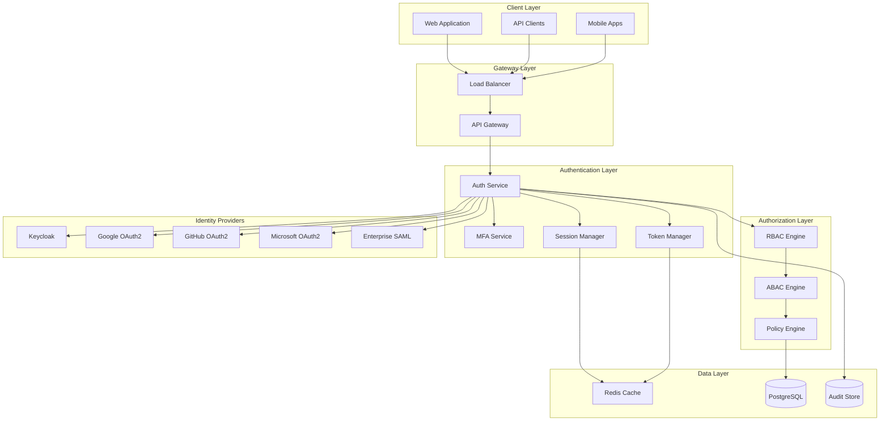

# Enhanced Authentication & Authorization System Design

## Overview

This design document outlines the architecture for enhancing the existing authentication and authorization system with comprehensive multi-tenancy support, advanced OAuth2/OIDC integration, sophisticated token management, RBAC/ABAC capabilities, MFA support, session management, and API key management. The design builds upon the existing Keycloak integration and workspace-based multi-tenancy while maintaining backward compatibility.

## Architecture

### High-Level Architecture



### Multi-Tenancy Architecture

The system implements workspace-based multi-tenancy with the following isolation mechanisms:

1. **Data Isolation**: Workspace discriminator in all tenant-aware entities
2. **Security Context Isolation**: Workspace-scoped security contexts
3. **Resource Isolation**: Workspace-based resource access controls
4. **Configuration Isolation**: Per-workspace security policies and settings

## Components and Interfaces

### 1. Enhanced Authentication Service

#### Core Components

**AuthenticationService**

```kotlin
interface AuthenticationService {
    suspend fun authenticate(request: AuthenticationRequest): AuthenticationResult
    suspend fun refreshToken(refreshToken: String, workspaceId: WorkspaceId): TokenPair
    suspend fun logout(request: LogoutRequest): LogoutResult
    suspend fun validateToken(token: String, workspaceId: WorkspaceId): TokenValidationResult
}
```

**Multi-Provider OAuth2 Manager**

```kotlin
interface OAuth2ProviderManager {
    suspend fun getAvailableProviders(workspaceId: WorkspaceId): List<OAuth2Provider>

    /**
     * Initiates the OAuth2 authorization flow.
     * - Generates and returns a code_challenge (S256) and stores the code_verifier server-side.
     * - Generates and stores state and nonce values, bound to the workspace/session.
     * - Ensures state and nonce are time-limited and checked to prevent CSRF/replay attacks.
     */
    suspend fun initiateOAuth2Flow(provider: OAuth2Provider, workspaceId: WorkspaceId): OAuth2FlowResult

    /**
     * Handles the OAuth2 callback.
     * - Validates the state and nonce values against stored entries.
     * - Verifies the returned code against the stored code_verifier (S256).
     * - Exchanges the authorization code for tokens upon successful validation.
     * - Includes failure paths for mismatches or invalid entries.
     */
    suspend fun handleCallback(provider: OAuth2Provider, code: String, state: String, nonce: String): OAuth2CallbackResult

    suspend fun mapProviderAttributes(provider: OAuth2Provider, attributes: Map<String, Any>): UserAttributes
}
```

#### OAuth2 Provider Configurations

**Google OAuth2 Provider**

- Scopes: `openid`, `profile`, `email`
- Custom attribute mapping for workspace assignment
- Support for Google Workspace domain restrictions

**GitHub OAuth2 Provider**

- Scopes: `user:email`, `read:org`
- Organization-based workspace mapping
- Team-based role assignment

**Microsoft OAuth2 Provider**

- Scopes: `openid`, `profile`, `email`, `User.Read`
- Azure AD tenant integration
- Group-based role mapping

**Enterprise SAML Provider**

- SAML 2.0 assertion processing
- Custom attribute mapping configuration
- Just-in-time user provisioning

### 2. Advanced Token Management

#### JWT Enhancement

**Enhanced JWT Structure**

```json
{
  "sub": "user-uuid",
  "iss": "loomify-auth",
  "aud": ["loomify-api"],
  "exp": 1640995200,
  "iat": 1640991600,
  "jti": "token-uuid",
  "workspace_id": "workspace-uuid",
  "workspace_role": "ADMIN",
  "permissions": ["workspace:read", "workspace:write"],
  "attributes": {
    "department": "engineering",
    "clearance_level": "confidential"
  },
  "session_id": "session-uuid",
  "mfa_verified": true,
  "token_type": "access"
}
```

**Token Manager Interface**

```kotlin
interface TokenManager {
    suspend fun issueTokenPair(user: User, workspace: Workspace, context: AuthContext): TokenPair
    suspend fun refreshTokenPair(refreshToken: RefreshToken): TokenPair
    suspend fun revokeToken(tokenId: String, reason: RevocationReason): RevocationResult
    suspend fun blacklistToken(tokenId: String, expiresAt: Instant): BlacklistResult
    suspend fun isTokenBlacklisted(tokenId: String): Boolean
    suspend fun rotateRefreshToken(oldToken: RefreshToken): RefreshToken
}
```

#### Token Rotation Policy

**Automatic Rotation Strategy**

- Refresh tokens rotate on every use
- Configurable grace period for old tokens
- Automatic cleanup of expired tokens
- Suspicious activity detection and forced rotation

### 3. RBAC/ABAC System

#### Role-Based Access Control (RBAC)

**Role Hierarchy**

```kotlin
enum class SystemRole(val level: Int, val inherits: List<SystemRole> = emptyList()) {
    SUPER_ADMIN(100),
    PLATFORM_ADMIN(90),
    WORKSPACE_OWNER(80),
    WORKSPACE_ADMIN(70, listOf(WORKSPACE_EDITOR)),
    WORKSPACE_EDITOR(60, listOf(WORKSPACE_VIEWER)),
    WORKSPACE_VIEWER(50),
    API_USER(40),
    GUEST(10)
}
```

**Permission System**

```kotlin
data class Permission(
    val resource: String,      // e.g., "workspace", "user", "api-key"
    val action: String,        // e.g., "read", "write", "delete", "admin"
    val scope: PermissionScope // GLOBAL, WORKSPACE, RESOURCE
)

interface RBACEngine {
    suspend fun hasPermission(user: User, permission: Permission, context: AuthContext): Boolean
    suspend fun getUserPermissions(user: User, workspace: Workspace): Set<Permission>
    suspend fun assignRole(user: User, role: Role, workspace: Workspace): RoleAssignmentResult
    suspend fun revokeRole(user: User, role: Role, workspace: Workspace): RoleRevocationResult
}
```

#### Attribute-Based Access Control (ABAC)

**Policy Engine**

```kotlin
interface ABACPolicyEngine {
    suspend fun evaluatePolicy(
        subject: Subject,
        resource: Resource,
        action: Action,
        environment: Environment
    ): PolicyDecision

    suspend fun createPolicy(policy: ABACPolicy): PolicyCreationResult
    suspend fun updatePolicy(policyId: String, policy: ABACPolicy): PolicyUpdateResult
    suspend fun deletePolicy(policyId: String): PolicyDeletionResult
}
```

**Policy Definition Language**

```json
{
  "id": "confidential-data-access",
  "name": "Confidential Data Access Policy",
  "description": "Restricts access to confidential data based on clearance level",
  "rules": [
    {
      "effect": "ALLOW",
      "condition": {
        "and": [
          {
            "subject.clearance_level": {
              "in": ["confidential", "secret", "top_secret"]
            }
          },
          {
            "resource.classification": {
              "equals": "confidential"
            }
          },
          {
            "environment.time": {
              "between": ["09:00", "17:00"]
            }
          }
        ]
      }
    }
  ]
}
```

### 4. Multi-Factor Authentication (MFA)

#### MFA Service Architecture

**MFA Manager Interface**

```kotlin
interface MFAManager {
    suspend fun setupTOTP(user: User): TOTPSetupResult
    suspend fun setupSMS(user: User, phoneNumber: String): SMSSetupResult
    suspend fun verifyTOTP(user: User, code: String): MFAVerificationResult
    suspend fun verifySMS(user: User, code: String): MFAVerificationResult
    suspend fun generateBackupCodes(user: User): BackupCodesResult
    suspend fun verifyBackupCode(user: User, code: String): MFAVerificationResult
    suspend fun getMFAStatus(user: User): MFAStatus
}
```

#### Supported MFA Methods

**TOTP (Time-based One-Time Password)**

- RFC 6238 compliant implementation
- QR code generation for authenticator apps
- 30-second time window with clock skew tolerance
- Support for Google Authenticator, Authy, etc.

**SMS-based OTP**

- Integration with SMS providers (Twilio, AWS SNS)
- Rate limiting and fraud detection
- International phone number support
- Fallback mechanisms for delivery failures

**Authenticator Apps**

- Push notification support
- Biometric verification integration
- Device registration and management
- Offline capability with TOTP fallback

**Backup Codes**

- One-time use recovery codes
- Secure generation and storage
- Automatic regeneration after use
- Encrypted storage with user-specific keys

### 5. Session Management

#### Session Architecture

**Session Manager Interface**

```kotlin
interface SessionManager {
    suspend fun createSession(user: User, workspace: Workspace, device: DeviceInfo): Session
    suspend fun getActiveSessions(user: User): List<Session>
    suspend fun terminateSession(sessionId: String, reason: TerminationReason): TerminationResult
    suspend fun terminateAllSessions(user: User, except: String? = null): TerminationResult
    suspend fun updateSessionActivity(sessionId: String, activity: SessionActivity): UpdateResult
    suspend fun detectSuspiciousActivity(session: Session): SuspiciousActivityResult
}
```

**Session Data Model**

```kotlin
data class Session(
    val id: SessionId,
    val userId: UserId,
    val workspaceId: WorkspaceId,
    val deviceInfo: DeviceInfo,
    val ipAddress: String,
    val userAgent: String,
    val location: GeoLocation?,
    val createdAt: Instant,
    val lastActivity: Instant,
    val expiresAt: Instant,
    val status: SessionStatus,
    val mfaVerified: Boolean,
    val riskScore: Int
)

data class DeviceInfo(
    val deviceId: String,
    val deviceType: DeviceType,
    val operatingSystem: String,
    val browser: String?,
    val isKnownDevice: Boolean
)
```

#### Session Security Features

**Concurrent Session Management**

- Configurable session limits per user per workspace
- Automatic termination of oldest sessions when limit exceeded
- Real-time session monitoring and alerts

**Suspicious Activity Detection**

- Geolocation-based anomaly detection
- Device fingerprinting and recognition
- Behavioral pattern analysis
- Automatic session termination for high-risk activities

### 6. API Key Management

#### API Key Service

**API Key Manager Interface**

```kotlin
interface APIKeyManager {
    suspend fun generateAPIKey(request: APIKeyGenerationRequest): APIKeyResult
    suspend fun rotateAPIKey(keyId: String, overlapPeriod: Duration): APIKeyRotationResult
    suspend fun revokeAPIKey(keyId: String, reason: RevocationReason): RevocationResult
    suspend fun validateAPIKey(key: String): APIKeyValidationResult
    suspend fun getAPIKeys(workspace: Workspace, user: User): List<APIKeyInfo>
    suspend fun updateAPIKeyScopes(keyId: String, scopes: Set<String>): UpdateResult
}
```

**API Key Data Model**

```kotlin
data class APIKey(
    val id: APIKeyId,
    val name: String,
    val description: String?,
    val workspaceId: WorkspaceId,
    val createdBy: UserId,
    val keyHash: String,        // Hashed version of the actual key
    val scopes: Set<String>,    // Permitted operations
    val rateLimit: RateLimit?,  // Optional rate limiting
    val ipWhitelist: Set<String>?, // Optional IP restrictions
    val createdAt: Instant,
    val expiresAt: Instant?,
    val lastUsed: Instant?,
    val status: APIKeyStatus,
    val usageCount: Long
)
```

#### API Key Security Features

**Scoped Permissions**

- Fine-grained scope definitions (e.g., `workspace:read`, `users:write`)
- Workspace-specific scope enforcement
- Time-based scope restrictions

**Rate Limiting**

- Per-key rate limiting with configurable windows
- Burst capacity and sustained rate controls
- Automatic throttling and backoff mechanisms

**Security Controls**

- IP address whitelisting
- Automatic key rotation with overlap periods
- Usage monitoring and anomaly detection
- Audit logging for all key operations

## Data Models

### Enhanced User Model

```kotlin
data class User(
    override val id: UserId,
    val username: Username,
    val email: Email,
    val firstName: FirstName?,
    val lastName: LastName?,
    val isActive: Boolean,
    val emailVerified: Boolean,
    val mfaEnabled: Boolean,
    val mfaMethods: Set<MFAMethod>,
    val lastLogin: Instant?,
    val passwordChangedAt: Instant?,
    val accountLocked: Boolean,
    val lockReason: String?,
    val attributes: Map<String, Any>,
    val preferences: UserPreferences,
    override val createdAt: LocalDateTime,
    override val createdBy: String,
    override var updatedAt: LocalDateTime?,
    override var updatedBy: String?
) : AggregateRoot<UserId>()
```

### Workspace Security Context

```kotlin
data class WorkspaceSecurityContext(
    val workspaceId: WorkspaceId,
    val securityPolicies: Set<SecurityPolicy>,
    val mfaRequirement: MFARequirement,
    val sessionTimeout: Duration,
    val allowedOAuth2Providers: Set<OAuth2Provider>,
    val ipWhitelist: Set<String>?,
    val allowedDomains: Set<String>?,
    val auditLevel: AuditLevel,
    val encryptionSettings: EncryptionSettings
)
```

### Permission and Role Models

```kotlin
data class WorkspaceRole(
    val id: RoleId,
    val workspaceId: WorkspaceId,
    val name: String,
    val description: String?,
    val permissions: Set<Permission>,
    val inheritsFrom: Set<RoleId>,
    val isSystemRole: Boolean,
    val createdAt: Instant,
    val updatedAt: Instant?
)

data class UserRoleAssignment(
    val id: AssignmentId,
    val userId: UserId,
    val roleId: RoleId,
    val workspaceId: WorkspaceId,
    val assignedBy: UserId,
    val assignedAt: Instant,
    val expiresAt: Instant?,
    val conditions: Set<AssignmentCondition>?
)
```

## Error Handling

### Authentication Errors

```kotlin
sealed class AuthenticationError(
    message: String,
    val errorCode: String,
    cause: Throwable? = null
) : RuntimeException(message, cause) {

    class InvalidCredentials(details: String? = null) :
        AuthenticationError("Invalid credentials${details?.let { ": $it" } ?: ""}", "AUTH_001")

    class AccountLocked(reason: String) :
        AuthenticationError("Account locked: $reason", "AUTH_002")

    class MFARequired(availableMethods: Set<MFAMethod>) :
        AuthenticationError("Multi-factor authentication required", "AUTH_003")

    class TokenExpired(tokenType: String) :
        AuthenticationError("$tokenType token has expired", "AUTH_004")

    class TokenRevoked(tokenId: String) :
        AuthenticationError("Token has been revoked", "AUTH_005")

    class OAuth2Error(provider: String, error: String) :
        AuthenticationError("OAuth2 authentication failed for $provider: $error", "AUTH_006")
}
```

### Authorization Errors

```kotlin
sealed class AuthorizationError(
    message: String,
    val errorCode: String,
    cause: Throwable? = null
) : RuntimeException(message, cause) {

    class InsufficientPermissions(resource: String, action: String) :
        AuthorizationError("Insufficient permissions for $action on $resource", "AUTHZ_001")

    class WorkspaceAccessDenied(workspaceId: String) :
        AuthorizationError("Access denied to workspace $workspaceId", "AUTHZ_002")

    class PolicyViolation(policyId: String, reason: String) :
        AuthorizationError("Policy violation: $reason", "AUTHZ_003")

    class ResourceNotFound(resourceType: String, resourceId: String) :
        AuthorizationError("$resourceType not found: $resourceId", "AUTHZ_004")
}
```

## Testing Strategy

### Unit Testing

**Authentication Service Tests**

- OAuth2 provider integration testing with mocked external services
- Token generation and validation logic
- MFA setup and verification flows
- Error handling and edge cases

**Authorization Engine Tests**

- RBAC permission evaluation with complex role hierarchies
- ABAC policy evaluation with various attribute combinations
- Performance testing for policy evaluation under load
- Security boundary testing

**Session Management Tests**

- Concurrent session handling and limits
- Suspicious activity detection algorithms
- Session cleanup and expiration handling
- Device recognition and fingerprinting

### Integration Testing

**End-to-End Authentication Flows**

- Complete OAuth2 flows with real provider sandboxes
- MFA setup and verification workflows
- Token refresh and rotation scenarios
- Cross-workspace authentication scenarios

**Security Integration Tests**

- Penetration testing for common vulnerabilities
- Rate limiting and DDoS protection testing
- Session hijacking and fixation prevention
- API key security and scope enforcement

### Performance Testing

**Load Testing Scenarios**

- High-volume authentication requests
- Concurrent session management
- Policy evaluation performance under load
- Token validation and caching efficiency

**Scalability Testing**

- Horizontal scaling of authentication services
- Database performance with large user bases
- Cache performance and invalidation strategies
- Multi-region deployment scenarios

## Security Considerations

### Data Protection

**Encryption at Rest**

- All sensitive data encrypted using AES-256
- Separate encryption keys per workspace
- Regular key rotation policies
- Hardware Security Module (HSM) integration for key management

**Encryption in Transit**

- TLS 1.3 for all external communications
- mTLS for internal service communications
- Certificate pinning for mobile applications
- Perfect Forward Secrecy (PFS) support

### Security Headers and Policies

**Content Security Policy (CSP)**

```
default-src 'self';
script-src 'self' 'nonce-{generated-nonce}' https://apis.google.com;
style-src 'self' 'nonce-{generated-nonce}';
img-src 'self' data: https:;
connect-src 'self' https://api.loomify.com https://subdomain.example.com;
report-uri https://csp-report.example.com;
report-to csp-endpoint;
```

**Implementation Notes**

- **Nonce-based Policies**: All inline scripts and styles must include a server-generated nonce (`{generated-nonce}`).
- **Hash-based Policies**: Alternatively, compute and apply hashes for static inline scripts/styles during the build process.
- **Reporting**: Configure the `report-uri` and `report-to` endpoints to collect CSP violation reports. Ensure the reporting endpoint is secure and monitored.
- **Build/Runtime Updates**:
  - Inject nonces dynamically for inline scripts/styles at runtime.
  - Update the build pipeline to compute hashes for static inline scripts/styles if hash-based policies are chosen.

**Additional Security Headers**

- `Strict-Transport-Security`: Force HTTPS
- `X-Frame-Options`: Prevent clickjacking
- `X-Content-Type-Options`: Prevent MIME sniffing
- `Referrer-Policy`: Control referrer information
- `Permissions-Policy`: Control browser features

### Audit and Compliance

**Audit Logging**

- All authentication and authorization events
- Administrative actions and configuration changes
- Data access and modification events
- Security incidents and responses

**Compliance Support**

- GDPR compliance with data portability and deletion
- SOC 2 Type II audit trail requirements
- HIPAA compliance for healthcare workspaces
- PCI DSS compliance for payment processing

### Threat Mitigation

**Common Attack Vectors**

- Brute force protection with progressive delays
- Account enumeration prevention
- Session fixation and hijacking protection
- Cross-Site Request Forgery (CSRF) protection
- SQL injection prevention through parameterized queries

**Advanced Threat Protection**

- Behavioral analysis for anomaly detection
- Machine learning-based fraud detection
- Real-time threat intelligence integration
- Automated incident response workflows

## Migration Strategy

### Phase 1: Foundation (Weeks 1-4)

- Enhanced token management implementation
- Basic RBAC system with existing roles
- MFA infrastructure setup
- Database schema migrations

### Phase 2: Core Features (Weeks 5-8)

- Multi-provider OAuth2 integration
- Advanced session management
- ABAC policy engine implementation
- API key management system

### Phase 3: Advanced Features (Weeks 9-12)

- Sophisticated MFA methods (push notifications, biometrics)
- Advanced threat detection and response
- Audit and compliance features
- Performance optimization and caching

### Phase 4: Integration and Testing (Weeks 13-16)

- End-to-end integration testing
- Security penetration testing
- Performance and load testing
- Documentation and training materials

## Monitoring and Observability

### Metrics and KPIs

**Authentication Metrics**

- Authentication success/failure rates
- OAuth2 provider performance and availability
- MFA adoption and usage rates
- Token refresh and rotation frequencies

**Authorization Metrics**

- Permission evaluation latency
- Policy evaluation success rates
- Access denial rates and reasons
- Role assignment and modification frequencies

**Security Metrics**

- Suspicious activity detection rates
- Account lockout frequencies and reasons
- Session anomaly detection accuracy
- API key usage patterns and violations

### Alerting and Notifications

**Critical Alerts**

- Multiple failed authentication attempts
- Suspicious session activities
- Policy violations and security breaches
- System component failures and degradations

**Operational Alerts**

- High authentication latency
- Token blacklist size thresholds
- MFA setup completion rates
- API key expiration warnings

This design provides a comprehensive foundation for implementing the enhanced authentication and authorization system while maintaining compatibility with existing infrastructure and ensuring scalability, security, and maintainability.
