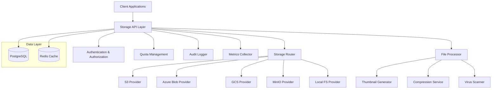
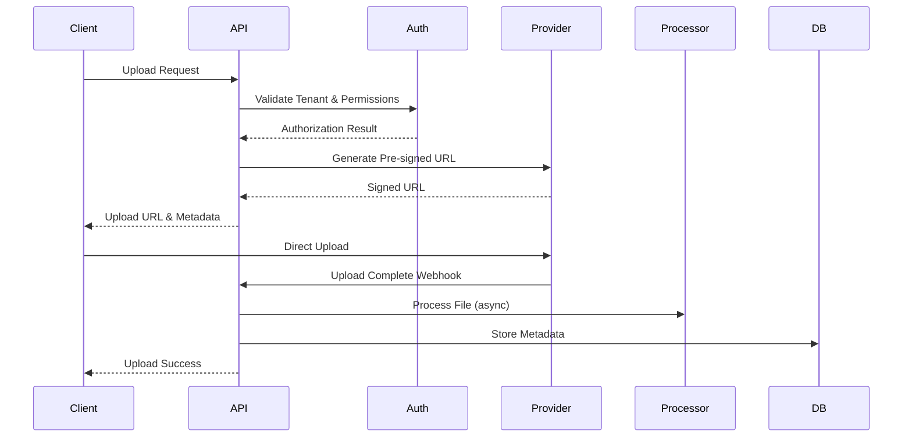

# Design Document

## Overview

The File Storage Abstraction system provides a unified, reactive storage layer for the Loomify platform, supporting multiple cloud and local storage providers with enterprise-grade security, tenant isolation, and automatic file processing capabilities. The design follows a plugin-based architecture that allows seamless switching between storage backends while maintaining consistent behavior and security guarantees.

## Architecture

### High-Level Architecture



### Reactive Flow Architecture

The system uses Spring WebFlux reactive streams to handle file operations non-blockingly:



## Components and Interfaces

### Core Storage Interface

```kotlin
interface StorageProvider {
    suspend fun upload(request: UploadRequest): UploadResult
    suspend fun generateSignedUrl(key: String, options: SignedUrlOptions): SignedUrl
    suspend fun delete(key: String): Boolean
    suspend fun exists(key: String): Boolean
    suspend fun getMetadata(key: String): FileMetadata?
    fun supports(type: StorageType): Boolean
    suspend fun healthCheck(): HealthStatus
}

data class UploadRequest(
    val tenantId: String,
    val fileName: String,
    val contentType: String,
    val size: Long,
    val visibility: Visibility = Visibility.PRIVATE,
    val options: UploadOptions = UploadOptions()
)

data class UploadOptions(
    val virusScan: Boolean = true,
    val compression: CompressionType? = null,
    val generateThumbnails: Boolean = false,
    val maxSize: Long = 100.MB,
    val allowedTypes: Set<String> = emptySet()
)

data class UploadResult(
    val fileId: String,
    val key: String,
    val url: String?,
    val metadata: FileMetadata
)

enum class StorageType {
    S3, AZURE_BLOB, GCS, MINIO, LOCAL_FS
}

enum class Visibility {
    PRIVATE, PUBLIC, TENANT_SHARED
}
```

### Storage Router

```kotlin
@Component
class StorageRouter(
    private val providers: List<StorageProvider>,
    private val tenantConfig: TenantConfigurationService
) {
    suspend fun getProvider(tenantId: String, fileType: String? = null): StorageProvider {
        val config = tenantConfig.getStorageConfig(tenantId)
        return providers.first {
            it.supports(config.preferredProvider ?: fileType ?: throw IllegalArgumentException("No provider or fileType specified"))
        }
    }

    suspend fun getProviderForKey(key: String): StorageProvider {
        // Extract provider info from key prefix
        val providerType = extractProviderFromKey(key)
        return providers.first { it.supports(providerType) }
    }
}
```

### File Processing Pipeline

```kotlin
interface FileProcessor {
    suspend fun process(file: ProcessingRequest): ProcessingResult
    fun supports(contentType: String): Boolean
}

@Component
class FileProcessingOrchestrator(
    private val processors: List<FileProcessor>
) {
    suspend fun processFile(fileId: String, options: ProcessingOptions): Flow<ProcessingResult> {
        return flow {
            val file = fileRepository.findById(fileId) ?: return@flow

            processors
                .filter { it.supports(file.contentType) }
                .forEach { processor ->
                    try {
                        val result = processor.process(ProcessingRequest(file, options))
                        emit(result)
                    } catch (e: Exception) {
                        emit(ProcessingResult.error(processor::class.simpleName, e))
                    }
                }
        }
    }
}
```

### Quota Management

```kotlin
@Component
class QuotaManager(
    private val quotaRepository: QuotaRepository,
    private val usageRepository: UsageRepository,
    private val quotaEventPublisher: QuotaEventPublisher
) {
    suspend fun checkQuota(tenantId: String, additionalSize: Long): QuotaCheckResult {
        val quota = quotaRepository.findByTenantId(tenantId)
        val currentUsage = usageRepository.getCurrentUsage(tenantId)

        return when {
            currentUsage + additionalSize > quota.limit -> QuotaCheckResult.EXCEEDED
            currentUsage + additionalSize > (quota.limit * 95 / 100) -> QuotaCheckResult.WARNING
            else -> QuotaCheckResult.OK
        }
    }

    suspend fun updateUsage(tenantId: String, sizeChange: Long) {
        usageRepository.updateUsage(tenantId, sizeChange)

        // Emit quota events for monitoring
        quotaEventPublisher.publishUsageUpdate(tenantId, sizeChange)
    }
}
```

## Data Models

### File Metadata Entity

```kotlin
@Table("file_metadata")
data class FileMetadata(
    @Id val id: String = UUID.randomUUID().toString(),
    val tenantId: String,
    val originalName: String,
    val storageKey: String,
    val contentType: String,
    val size: Long,
    val visibility: Visibility,
    val uploadedBy: String,
    val uploadedAt: Instant = Instant.now(),
    val processingStatus: ProcessingStatus = ProcessingStatus.PENDING,
    val variants: Map<String, FileVariant> = emptyMap(),
    val tags: Set<String> = emptySet(),
    val metadata: Map<String, Any> = emptyMap()
)

data class FileVariant(
    val type: VariantType,
    val storageKey: String,
    val size: Long,
    val dimensions: Dimensions? = null
)

enum class VariantType {
    THUMBNAIL_SMALL, THUMBNAIL_MEDIUM, THUMBNAIL_LARGE, COMPRESSED, ORIGINAL
}
```

### Tenant Storage Configuration

```kotlin
@Table("tenant_storage_config")
data class TenantStorageConfig(
    @Id val tenantId: String,
    val preferredProvider: StorageType,
    val quotaLimit: Long,
    val allowedFileTypes: Set<String>,
    val maxFileSize: Long,
    val virusScanEnabled: Boolean = true,
    val compressionEnabled: Boolean = false,
    val thumbnailGeneration: Boolean = true,
    val cdnEnabled: Boolean = false,
    val cdnDomain: String? = null
)
```

### Audit Log Entity

```kotlin
@Table("file_audit_log")
data class FileAuditLog(
    @Id val id: String = UUID.randomUUID().toString(),
    val tenantId: String,
    val fileId: String,
    val action: AuditAction,
    val userId: String,
    val userAgent: String? = null,
    val ipAddress: String? = null,
    val timestamp: Instant = Instant.now(),
    val metadata: Map<String, Any> = emptyMap()
)

enum class AuditAction {
    UPLOAD, DOWNLOAD, DELETE, SHARE, ACCESS_DENIED, QUOTA_EXCEEDED
}
```

## Error Handling

### Exception Hierarchy

```kotlin
sealed class StorageException(message: String, cause: Throwable? = null) : Exception(message, cause)

class QuotaExceededException(tenantId: String, requested: Long, available: Long) :
    StorageException("Quota exceeded for tenant $tenantId: requested $requested, available $available")

class FileNotFoundException(fileId: String) :
    StorageException("File not found: $fileId")

class UnauthorizedAccessException(tenantId: String, fileId: String) :
    StorageException("Unauthorized access to file $fileId by tenant $tenantId")

class ProviderUnavailableException(provider: StorageType, cause: Throwable) :
    StorageException("Storage provider $provider is unavailable", cause)

class VirusScanFailedException(fileId: String, scanResult: String) :
    StorageException("Virus scan failed for file $fileId: $scanResult")
```

### Error Response Handling

```kotlin
@Component
class StorageErrorHandler {
    fun handleError(error: Throwable): ResponseEntity<ErrorResponse> {
        return when (error) {
            is QuotaExceededException -> ResponseEntity.status(413)
                .body(ErrorResponse("QUOTA_EXCEEDED", error.message))
            is FileNotFoundException -> ResponseEntity.notFound()
                .build()
            is UnauthorizedAccessException -> ResponseEntity.status(403)
                .body(ErrorResponse("UNAUTHORIZED", error.message))
            is ProviderUnavailableException -> ResponseEntity.status(503)
                .body(ErrorResponse("SERVICE_UNAVAILABLE", "Storage temporarily unavailable"))
            else -> ResponseEntity.status(500)
                .body(ErrorResponse("INTERNAL_ERROR", "An unexpected error occurred"))
        }
    }
}
```

## Testing Strategy

### Unit Testing Approach

- **Provider Implementations**: Test each storage provider with mocked cloud SDKs
- **File Processing**: Test processors with sample files and verify outputs
- **Quota Management**: Test quota calculations and enforcement logic
- **Security**: Test access control and tenant isolation

### Integration Testing

- **End-to-End Flows**: Test complete upload/download cycles
- **Provider Failover**: Test behavior when providers are unavailable
- **Multi-tenant Isolation**: Verify tenant data separation
- **Performance**: Test with large files and concurrent operations

### Test Containers Setup

```kotlin
@TestConfiguration
class StorageTestConfiguration {
    @Bean
    @Primary
    fun testStorageProvider(): StorageProvider = MockStorageProvider()

    @Bean
    fun minioContainer(): GenericContainer<*> =
        GenericContainer("minio/minio:latest")
            .withExposedPorts(9000)
            .withEnv("MINIO_ACCESS_KEY", "testkey")
            .withEnv("MINIO_SECRET_KEY", "testsecret")
}
```

## Security Considerations

### Access Control Matrix

| Operation | Tenant Admin | Tenant User | External User |
|-----------|--------------|-------------|---------------|
| Upload to tenant | ✅ | ✅ | ❌ |
| Download tenant files | ✅ | ✅ (own files) | ❌ |
| Delete tenant files | ✅ | ✅ (own files) | ❌ |
| Manage quotas | ✅ | ❌ | ❌ |
| View audit logs | ✅ | ❌ | ❌ |

### Security Implementation

```kotlin
@Component
class FileSecurityService(
    private val tenantService: TenantService
) {
    suspend fun checkAccess(
        userId: String,
        tenantId: String,
        fileId: String,
        operation: FileOperation
    ): AccessResult {
        val userTenants = tenantService.getUserTenants(userId)

        if (!userTenants.contains(tenantId)) {
            return AccessResult.DENIED("User not member of tenant")
        }

        val file = fileRepository.findById(fileId)
        if (file?.tenantId != tenantId) {
            return AccessResult.DENIED("File not in user's tenant")
        }

        return when (operation) {
            FileOperation.READ -> checkReadAccess(userId, file)
            FileOperation.WRITE -> checkWriteAccess(userId, file)
            FileOperation.DELETE -> checkDeleteAccess(userId, file)
        }
    }
}
```

## Performance Optimizations

### Caching Strategy

- **Metadata Caching**: Cache file metadata in Redis for 1 hour
- **Signed URL Caching**: Cache pre-signed URLs for 15 minutes
- **Quota Caching**: Cache quota information for 5 minutes
- **CDN Integration**: Use CloudFront/Cloudflare for public file delivery

### Reactive Optimizations

- **Backpressure Handling**: Use Flux.buffer() for batch operations
- **Connection Pooling**: Configure reactive HTTP clients with appropriate pool sizes
- **Streaming**: Use reactive streams for large file operations
- **Parallel Processing**: Process file variants concurrently using Flux.parallel()

## Monitoring and Observability

### Metrics Collection

```kotlin
@Component
class StorageMetrics(
    private val meterRegistry: MeterRegistry
) {
    private val uploadCounter = Counter.builder("storage.uploads.total")
        .tag("provider", "unknown")
        .register(meterRegistry)

    private val uploadTimer = Timer.builder("storage.upload.duration")
        .register(meterRegistry)

    fun recordUpload(provider: StorageType, duration: Duration, success: Boolean) {
        meterRegistry.counter("storage.uploads.total", "provider", provider.name, "success", success.toString()).increment()
        meterRegistry.timer("storage.upload.duration", "provider", provider.name, "success", success.toString()).record(duration)
    }
}
```

### Health Checks

```kotlin
@Component
class StorageHealthIndicator(
    private val providers: List<StorageProvider>
) : ReactiveHealthIndicator {
    override fun doHealthCheck(builder: Health.Builder): Mono<Health> {
        return Flux.fromIterable(providers)
            .flatMap { provider ->
                provider.healthCheck()
                    .map { status -> provider.javaClass.simpleName to status }
            }
            .collectMap({ it.first }, { it.second })
            .map { results ->
                val allHealthy = results.values.all { it.isHealthy }
                if (allHealthy) {
                    builder.up().withDetails(results).build()
                } else {
                    builder.down().withDetails(results).build()
                }
            }
    }
}
```
