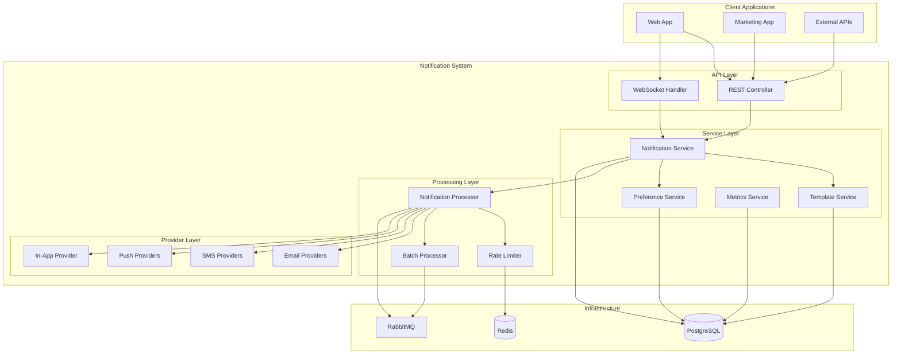
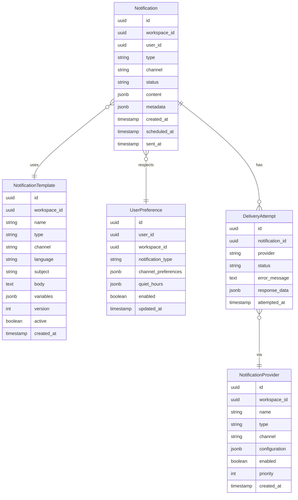

# Design Document

## Overview

The notification system is designed as a reactive, multi-channel communication platform built on Spring Boot WebFlux. It provides a unified API for sending notifications across email, SMS, push, and in-app channels while supporting provider abstraction, template management, delivery tracking, and intelligent rate limiting.

The system follows a domain-driven design approach with clear separation of concerns and leverages Spring's messaging infrastructure for reliable asynchronous processing.

## Architecture

### High-Level Architecture



### Domain Model



## Components and Interfaces

### Core Services

#### NotificationService
```kotlin
interface NotificationService {
    suspend fun sendNotification(request: NotificationRequest): NotificationResponse
    suspend fun scheduleNotification(request: ScheduledNotificationRequest): NotificationResponse
    suspend fun getNotificationStatus(notificationId: UUID): NotificationStatus
    suspend fun cancelNotification(notificationId: UUID): Boolean
    suspend fun getNotificationHistory(userId: UUID, pageable: Pageable): Flow<Notification>
}
```

#### TemplateService
```kotlin
interface TemplateService {
    suspend fun createTemplate(template: NotificationTemplate): NotificationTemplate
    suspend fun updateTemplate(id: UUID, template: NotificationTemplate): NotificationTemplate
    suspend fun getTemplate(name: String, type: String, channel: String, language: String): NotificationTemplate?
    suspend fun renderTemplate(templateId: UUID, variables: Map<String, Any>): RenderedTemplate
    suspend fun validateTemplate(template: NotificationTemplate): ValidationResult
}
```

#### PreferenceService
```kotlin
interface PreferenceService {
    suspend fun getUserPreferences(userId: UUID, workspaceId: UUID): UserPreference
    suspend fun updatePreferences(userId: UUID, preferences: UserPreference): UserPreference
    suspend fun canSendNotification(userId: UUID, notificationType: String, channel: String): Boolean
    suspend fun getOptimalChannel(userId: UUID, notificationType: String): String?
}
```

### Provider Abstraction

#### NotificationProvider Interface
```kotlin
interface NotificationProvider {
    val type: ProviderType
    val channels: Set<NotificationChannel>

    suspend fun send(notification: ProcessedNotification): DeliveryResult
    suspend fun validateConfiguration(config: ProviderConfiguration): ValidationResult
    suspend fun getDeliveryStatus(externalId: String): DeliveryStatus
    fun supportsFeature(feature: ProviderFeature): Boolean
}
```

#### Provider Implementations
- **EmailProvider**: SendGrid, AWS SES, SMTP implementations
- **SmsProvider**: Twilio, AWS SNS implementations
- **PushProvider**: Firebase FCM, Apple APNs implementations
- **InAppProvider**: WebSocket-based real-time delivery

### Processing Components

#### NotificationProcessor
```kotlin
@Component
class NotificationProcessor {
    suspend fun processNotification(notification: Notification): ProcessingResult
    suspend fun selectProvider(channel: String, workspaceId: UUID): NotificationProvider
    suspend fun applyRateLimit(userId: UUID, channel: String): RateLimitResult
    suspend fun batchNotifications(notifications: List<Notification>): List<NotificationBatch>
}
```

#### RateLimiter
```kotlin
interface RateLimiter {
    suspend fun checkLimit(key: String, limit: RateLimit): RateLimitResult
    suspend fun consumeTokens(key: String, tokens: Int): Boolean
    suspend fun getRemainingTokens(key: String): Int
    suspend fun resetLimit(key: String): Boolean
}
```

### Data Models

#### Core Request/Response Models
```kotlin
data class NotificationRequest(
    val workspaceId: UUID,
    val userId: UUID,
    val type: String,
    val channels: Set<NotificationChannel> = emptySet(),
    val templateName: String? = null,
    val content: NotificationContent? = null,
    val variables: Map<String, Any> = emptyMap(),
    val priority: NotificationPriority = NotificationPriority.NORMAL,
    val scheduledAt: Instant? = null,
    val metadata: Map<String, Any> = emptyMap()
)

data class NotificationContent(
    val subject: String? = null,
    val body: String,
    val htmlBody: String? = null,
    val attachments: List<Attachment> = emptyList()
)

data class ProcessedNotification(
    val id: UUID,
    val recipient: NotificationRecipient,
    val content: RenderedContent,
    val channel: NotificationChannel,
    val provider: String,
    val metadata: Map<String, Any>
)
```

## Error Handling

### Error Categories
1. **Validation Errors**: Invalid request data, missing required fields
2. **Provider Errors**: External service failures, rate limits, authentication issues
3. **Template Errors**: Missing templates, rendering failures, variable validation
4. **Preference Errors**: User opt-out violations, channel restrictions
5. **System Errors**: Database failures, messaging queue issues

### Error Handling Strategy
```kotlin
sealed class NotificationError(message: String, cause: Throwable? = null) : Exception(message, cause) {
    class ValidationError(message: String) : NotificationError(message)
    class ProviderError(val provider: String, message: String, cause: Throwable? = null) : NotificationError(message, cause)
    class TemplateError(val templateId: UUID, message: String) : NotificationError(message)
    class PreferenceError(val userId: UUID, message: String) : NotificationError(message)
    class RateLimitError(val key: String, val retryAfter: Duration) : NotificationError("Rate limit exceeded")
}
```

### Retry Strategy
- **Exponential Backoff**: 1s, 2s, 4s, 8s, 16s intervals
- **Maximum Retries**: 5 attempts for transient failures
- **Dead Letter Queue**: Failed notifications after max retries
- **Circuit Breaker**: Temporary provider disabling on repeated failures

## Testing Strategy

### Unit Testing
- **Service Layer**: Mock dependencies, test business logic
- **Provider Layer**: Test provider implementations with mock responses
- **Template Engine**: Test rendering with various input scenarios
- **Rate Limiter**: Test token bucket algorithms and edge cases

### Integration Testing
- **Database Layer**: Test repository operations with test containers
- **Message Queue**: Test async processing with embedded RabbitMQ
- **Provider Integration**: Test with provider sandbox environments
- **End-to-End Flows**: Test complete notification workflows

### Performance Testing
- **Load Testing**: Simulate high notification volumes
- **Rate Limit Testing**: Verify rate limiting behavior under load
- **Provider Failover**: Test automatic failover scenarios
- **Memory Usage**: Monitor memory consumption during batch processing

### Test Data Management
```kotlin
@TestConfiguration
class NotificationTestConfig {
    @Bean
    @Primary
    fun testNotificationProviders(): List<NotificationProvider> = listOf(
        MockEmailProvider(),
        MockSmsProvider(),
        MockPushProvider()
    )
}
```

## Configuration

### Application Properties
```yaml
loomify:
  notification:
    async:
      enabled: true
      queue-name: notifications
      batch-size: 100
      batch-timeout: 5s
    rate-limiting:
      enabled: true
      redis-key-prefix: "rate_limit:"
      default-limits:
        email: "100/hour"
        sms: "50/hour"
        push: "1000/hour"
    providers:
      email:
        primary: sendgrid
        fallback: [aws-ses, smtp]
      sms:
        primary: twilio
        fallback: [aws-sns]
    templates:
      cache-ttl: 300s
      default-language: en
    metrics:
      enabled: true
      retention-days: 30
```

### Provider Configuration
```kotlin
@ConfigurationProperties("loomify.notification.providers")
data class ProviderConfiguration(
    val email: EmailProviderConfig,
    val sms: SmsProviderConfig,
    val push: PushProviderConfig
)

data class EmailProviderConfig(
    val sendgrid: SendGridConfig?,
    val awsSes: AwsSesConfig?,
    val smtp: SmtpConfig?
)
```

## Security Considerations

### Authentication & Authorization
- **Workspace Isolation**: All notifications scoped to workspace
- **User Permissions**: Verify user can send notifications in workspace
- **API Authentication**: JWT tokens for external API access
- **Provider Credentials**: Encrypted storage of provider API keys

### Data Protection
- **PII Handling**: Encrypt sensitive notification content
- **Audit Logging**: Track all notification activities
- **Data Retention**: Configurable retention policies for notification history
- **GDPR Compliance**: Support for data deletion requests

### Rate Limiting Security
- **DDoS Protection**: Global rate limits to prevent abuse
- **User-based Limits**: Per-user limits to prevent spam
- **IP-based Limits**: Additional protection for public APIs
- **Workspace Quotas**: Prevent workspace-level abuse

#### Security and Encoding Strategy

To prevent XSS and content injection vulnerabilities in `NotificationContent`, the following safeguards are implemented:

1. **Explicit Encoding Rules per Channel**:
   - **HTML**: All HTML content must be HTML-escaped and sanitized using an allow-list of safe tags and attributes.
   - **Plain Text**: Strip or escape any HTML content to ensure only plain text is rendered.
   - **JSON**: All values must be JSON-encoded to prevent injection.

2. **Template Engine Safeguards**:
   - The chosen template engine must have auto-escape enabled for HTML templates.
   - Strict variable context typing must be enforced to prevent type confusion.

3. **Validation and Escaping at Render Time**:
   - All template variables must be validated and escaped during rendering.
   - Any HTML input must be passed through a sanitizer or rendered only from a vetted allow-list of tags and attributes.

4. **Content Metadata and Enforcement**:
   - Add metadata/flags to `NotificationContent` indicating whether the content has been sanitized.
   - Include an enforcement point in the sending pipeline to reject or sanitize unsafely flagged notifications.

5. **Testing**:
   - Add unit and integration tests to assert encoding and sanitization behavior for each channel.
   - Ensure tests cover edge cases for all supported content types and channels.

### Compliance & Feedback Loops

- **Unsubscribe Links**: Include unsubscribe links in all user-facing messages and honor per-user preference settings to comply with CAN-SPAM and GDPR.
- **Encrypted Suppression Lists**: Maintain encrypted suppression lists and automated suppression logic that respects user preferences and consent.
- **Webhook Endpoints**: Implement provider webhook endpoints to receive bounces/complaints and automatically update suppression lists.
- **Idempotency and Correlation**: Require idempotency keys on send requests and attach correlation IDs to messages and logs for deduplication and end-to-end tracing.
- **Data Storage and Retention**:
  - Store suppression data securely with encryption.
  - Define retention and expiry policies for suppression data.
- **Architecture Placement**:
  - Webhook handlers should process bounces/complaints and update suppression lists.
  - Idempotency and correlation processing should be enforced in the sending pipeline.
