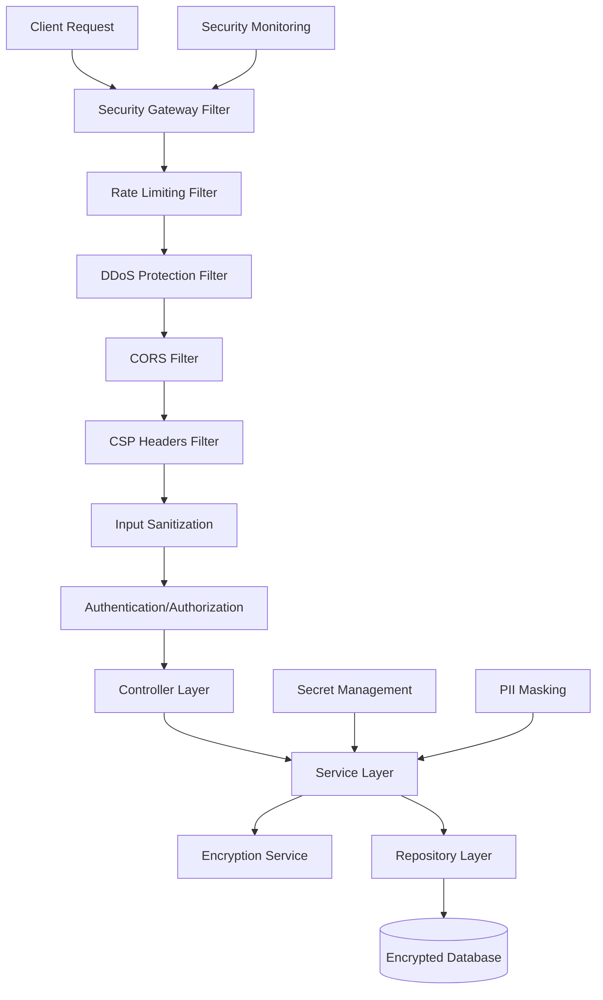

# Security Hardening Design Document

## Overview

This design implements comprehensive security hardening for the Loomify SaaS platform, addressing critical security gaps through multiple layers of protection. The solution integrates seamlessly with the existing Spring Boot WebFlux reactive architecture, Keycloak authentication, and multi-tenant design while adding enterprise-grade security controls.

The security hardening feature provides defense-in-depth through rate limiting, DDoS protection, input sanitization, encryption, and compliance features. All components are designed to work reactively with minimal performance impact and support the platform's multi-tenant architecture.

## Architecture

### High-Level Architecture



### Security Filter Chain

The security implementation uses Spring WebFlux's reactive filter chain with custom security filters ordered appropriately:

1. **Security Gateway Filter** - Entry point for all security processing
2. **Rate Limiting Filter** - Per-endpoint, per-tenant, per-user rate limiting
3. **DDoS Protection Filter** - Traffic analysis and IP blocking
4. **CORS Filter** - Dynamic cross-origin request validation
5. **CSP Headers Filter** - Content Security Policy header injection
6. **Input Sanitization Filter** - XSS and injection prevention
7. **Authentication/Authorization** - Existing Keycloak integration

## Components and Interfaces

### 1. Rate Limiting Component

**Interface: `ReactiveRateLimitService`**

```kotlin
interface ReactiveRateLimitService {
    fun checkRateLimit(request: ServerHttpRequest, tenantId: String, userId: String?): Mono<RateLimitResult>
    fun getRateLimitConfig(endpoint: String, tenantId: String): Mono<RateLimitConfig>
    fun updateRateLimitConfig(config: RateLimitConfig): Mono<Void>
}
```

**Implementation Strategy:**

- Redis-based distributed rate limiting using reactive Redis operations
- Sliding window algorithm for accurate rate limiting
- Hierarchical rate limiting: global → tenant → user → endpoint
- Configurable time windows and limits per tenant

**Key Classes:**

- `RedisReactiveRateLimitService` - Redis-backed implementation
- `RateLimitFilter` - WebFlux filter for request interception
- `RateLimitConfig` - Configuration data class
- `RateLimitResult` - Result with allow/deny and retry information

### 2. DDoS Protection Component

**Interface: `DDoSProtectionService`**

```kotlin
interface DDoSProtectionService {
    fun analyzeTraffic(request: ServerHttpRequest): Mono<ThreatAssessment>
    fun blockIP(ipAddress: String, duration: Duration): Mono<Void>
    fun isIPBlocked(ipAddress: String): Mono<Boolean>
    fun getTrafficMetrics(ipAddress: String): Mono<TrafficMetrics>
}
```

**Implementation Strategy:**

- Real-time traffic pattern analysis using reactive streams
- Configurable thresholds for request frequency and patterns
- Automatic IP blocking with exponential backoff
- Integration with monitoring systems for alerting

**Key Classes:**

- `ReactiveTrafficAnalyzer` - Pattern detection and analysis
- `IPBlocklistService` - Manage blocked IP addresses
- `DDoSProtectionFilter` - Request filtering and blocking
- `ThreatAssessment` - Risk evaluation result

### 3. Dynamic CORS Management

**Interface: `TenantCorsConfigService`**

```kotlin
interface TenantCorsConfigService {
    fun getCorsConfig(tenantId: String): Mono<CorsConfiguration>
    fun updateCorsConfig(tenantId: String, config: CorsConfiguration): Mono<Void>
    fun validateOrigin(tenantId: String, origin: String): Mono<Boolean>
}
```

**Implementation Strategy:**

- Tenant-specific CORS configuration stored in database
- Dynamic configuration updates without restart
- Integration with Spring WebFlux CORS support
- Fallback to global CORS configuration

**Key Classes:**

- `TenantAwareCorsConfigurationSource` - Dynamic CORS source
- `CorsConfigRepository` - Database operations for CORS config
- `CorsValidationFilter` - Request origin validation

### 4. Content Security Policy (CSP)

**Interface: `CSPHeaderService`**

```kotlin
interface CSPHeaderService {
    fun generateCSPHeader(request: ServerHttpRequest, tenantId: String): Mono<String>
    fun generateNonce(): String
    fun reportViolation(violation: CSPViolationReport): Mono<Void>
}
```

**Implementation Strategy:**

- Context-aware CSP header generation
- Nonce-based script execution for dynamic content
- CSP violation reporting and monitoring
- Different policies for admin vs user interfaces

**Key Classes:**

- `CSPHeaderFilter` - Header injection filter
- `CSPViolationController` - Violation report endpoint
- `CSPConfigService` - Policy configuration management

### 5. Input Sanitization

**Interface: `InputSanitizationService`**

```kotlin
interface InputSanitizationService {
    fun sanitizeInput(input: String, context: SanitizationContext): Mono<String>
    fun validateInput(input: Any, validationRules: ValidationRules): Mono<ValidationResult>
    fun sanitizeHtml(html: String): Mono<String>
}
```

**Implementation Strategy:**

- Context-aware sanitization (HTML, JSON, query parameters)
- OWASP Java HTML Sanitizer integration
- Reactive validation pipeline
- Configurable sanitization rules per tenant

**Key Classes:**

- `ReactiveInputSanitizer` - Core sanitization logic
- `InputSanitizationFilter` - Request/response sanitization
- `ValidationRulesService` - Manage validation configurations
- `SanitizationContext` - Context information for sanitization

### 6. SQL Injection Prevention

**Implementation Strategy:**

- Enforce parameterized queries through R2DBC
- Custom repository base classes with query validation
- Static analysis integration (SpotBugs, CodeQL)
- Runtime query pattern monitoring

**Key Classes:**

- `SecureR2dbcRepository` - Base repository with security checks
- `QueryValidationAspect` - AOP-based query validation
- `SQLInjectionDetector` - Pattern-based detection

### 7. Secret Management Integration

**Interface: `SecretManagementService`**

```kotlin
interface SecretManagementService {
    fun getSecret(secretName: String): Mono<String>
    fun refreshSecrets(): Mono<Void>
    fun isSecretExpired(secretName: String): Mono<Boolean>
}
```

**Implementation Strategy:**

- Multi-provider support (AWS Secrets Manager, HashiCorp Vault)
- Reactive secret retrieval with caching
- Automatic secret rotation handling
- Fallback mechanisms for high availability

**Key Classes:**

- `AWSSecretsManagerService` - AWS integration
- `VaultSecretService` - HashiCorp Vault integration
- `SecretCacheService` - In-memory secure caching
- `SecretRotationScheduler` - Automatic rotation handling

### 8. Encryption at Rest

**Interface: `FieldEncryptionService`**

```kotlin
interface FieldEncryptionService {
    fun encrypt(plaintext: String, keyId: String): Mono<String>
    fun decrypt(ciphertext: String, keyId: String): Mono<String>
    fun rotateKey(oldKeyId: String, newKeyId: String): Mono<Void>
}
```

**Implementation Strategy:**

- Annotation-based field encryption (@Encrypted)
- AES-256-GCM encryption with key rotation support
- Integration with R2DBC converters for transparent encryption
- Key management through external services

**Key Classes:**

- `EncryptedFieldConverter` - R2DBC converter for automatic encryption
- `KeyManagementService` - Encryption key lifecycle management
- `EncryptionAspect` - AOP-based field encryption
- `@Encrypted` - Annotation for marking sensitive fields

### 9. PII Masking and Compliance

**Interface: `PIIMaskingService`**

```kotlin
interface PIIMaskingService {
    fun maskPII(data: Any, maskingContext: MaskingContext): Mono<Any>
    fun detectPII(text: String): Mono<List<PIIMatch>>
    fun generateComplianceReport(tenantId: String): Mono<ComplianceReport>
}
```

**Implementation Strategy:**

- Pattern-based PII detection (email, phone, SSN, etc.)
- Context-aware masking strategies (partial, full, tokenization)
- GDPR compliance features (right to be forgotten, data portability)
- Audit trail for all PII operations

**Key Classes:**

- `PIIDetectionService` - Pattern matching and ML-based detection
- `MaskingStrategyFactory` - Different masking approaches
- `ComplianceAuditService` - GDPR compliance tracking
- `PIIMaskingFilter` - Response masking filter

## Data Models

### Rate Limiting Configuration

```kotlin
@Table("rate_limit_configs")
data class RateLimitConfig(
    @Id val id: UUID,
    val tenantId: String,
    val endpoint: String,
    val requestsPerSecond: Int,
    val requestsPerMinute: Int,
    val requestsPerHour: Int,
    val requestsPerDay: Int,
    val burstCapacity: Int,
    val enabled: Boolean,
    val createdAt: Instant,
    val updatedAt: Instant
)
```

### Security Event Log

```kotlin
@Table("security_events")
data class SecurityEvent(
    @Id val id: UUID,
    val tenantId: String?,
    val userId: String?,
    val eventType: SecurityEventType,
    val severity: SecuritySeverity,
    val ipAddress: String,
    val userAgent: String?,
    val endpoint: String,
    val details: String, // JSON
    val timestamp: Instant
)
```

### Encryption Key Metadata

```kotlin
@Table("encryption_keys")
data class EncryptionKeyMetadata(
    @Id val keyId: String,
    val tenantId: String,
    val algorithm: String,
    val keyVersion: Int,
    val createdAt: Instant,
    val rotatedAt: Instant?,
    val status: KeyStatus
)
```

## Error Handling

### Security Exception Hierarchy

```kotlin
sealed class SecurityException(message: String) : RuntimeException(message)
class RateLimitExceededException(val retryAfter: Duration) : SecurityException("Rate limit exceeded")
class DDoSProtectionException(val blockedUntil: Instant) : SecurityException("Request blocked by DDoS protection")
class InputValidationException(val violations: List<String>) : SecurityException("Input validation failed")
class EncryptionException(cause: Throwable) : SecurityException("Encryption operation failed")
```

### Global Security Error Handler

```kotlin
@Component
class SecurityErrorHandler : ErrorWebExceptionHandler {
    override fun handle(exchange: ServerWebExchange, ex: Throwable): Mono<Void> {
        val correlationId = UUID.randomUUID().toString()
        log.error("Error ID: $correlationId", ex)

        val response = exchange.response
        response.headers.add("X-Correlation-ID", correlationId)

        return when (ex) {
            is RateLimitExceededException -> {
                response.statusCode = HttpStatus.TOO_MANY_REQUESTS
                response.headers.add("Retry-After", ex.retryAfter.seconds.toString())
                response.writeWith(Mono.just(response.bufferFactory().wrap("Rate limit exceeded".toByteArray())))
            }
            is DDoSProtectionException -> {
                response.statusCode = if (ex.blockedUntil.isAfter(Instant.now())) HttpStatus.TOO_MANY_REQUESTS else HttpStatus.FORBIDDEN
                response.headers.add("Retry-After", Duration.between(Instant.now(), ex.blockedUntil).seconds.toString())
                response.writeWith(Mono.just(response.bufferFactory().wrap("Request blocked".toByteArray())))
            }
            is InputValidationException -> {
                response.statusCode = HttpStatus.BAD_REQUEST
                response.writeWith(Mono.just(response.bufferFactory().wrap("Invalid request".toByteArray())))
            }
            else -> {
                response.statusCode = HttpStatus.INTERNAL_SERVER_ERROR
                response.writeWith(Mono.just(response.bufferFactory().wrap("Internal server error".toByteArray())))
            }
        }
    }
}
```

## Testing Strategy

### Unit Testing

- **Security Filter Tests**: Mock request/response testing for each security filter
- **Service Layer Tests**: Test security services with reactive test support
- **Encryption Tests**: Verify encryption/decryption operations and key rotation
- **Validation Tests**: Test input sanitization and validation rules

### Integration Testing

- **Security Chain Tests**: End-to-end security filter chain testing
- **Database Encryption Tests**: Verify transparent field encryption with R2DBC
- **Secret Management Tests**: Test integration with external secret services
- **Multi-tenant Tests**: Verify tenant isolation in security configurations

### Security Testing

- **Penetration Testing**: Automated security scanning with OWASP ZAP
- **Rate Limiting Tests**: Load testing to verify rate limiting effectiveness
- **Input Fuzzing**: Automated fuzzing of input sanitization
- **Compliance Tests**: Verify GDPR and privacy compliance features

### Performance Testing

- **Security Overhead Tests**: Measure performance impact of security filters
- **Encryption Performance**: Benchmark encryption/decryption operations
- **Rate Limiting Performance**: Test rate limiting under high load
- **Memory Usage Tests**: Monitor memory usage of security caching

## Configuration

### Application Configuration

```yaml
loomify:
  security:
    rate-limiting:
      enabled: true
      default-requests-per-second: 100
      default-burst-capacity: 200
      redis-key-prefix: "rate_limit:"

    ddos-protection:
      enabled: true
      analysis-window: PT5M
      threshold-multiplier: 10
      block-duration: PT1H

    encryption:
      provider: "aws-kms"
      key-rotation-days: 90
      cache-ttl: PT1H

    pii-masking:
      enabled: true
      default-strategy: "partial"
      audit-enabled: true
```
