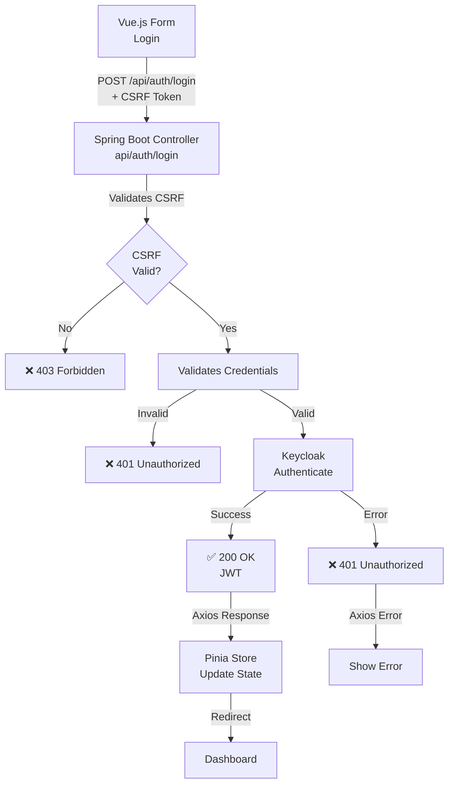
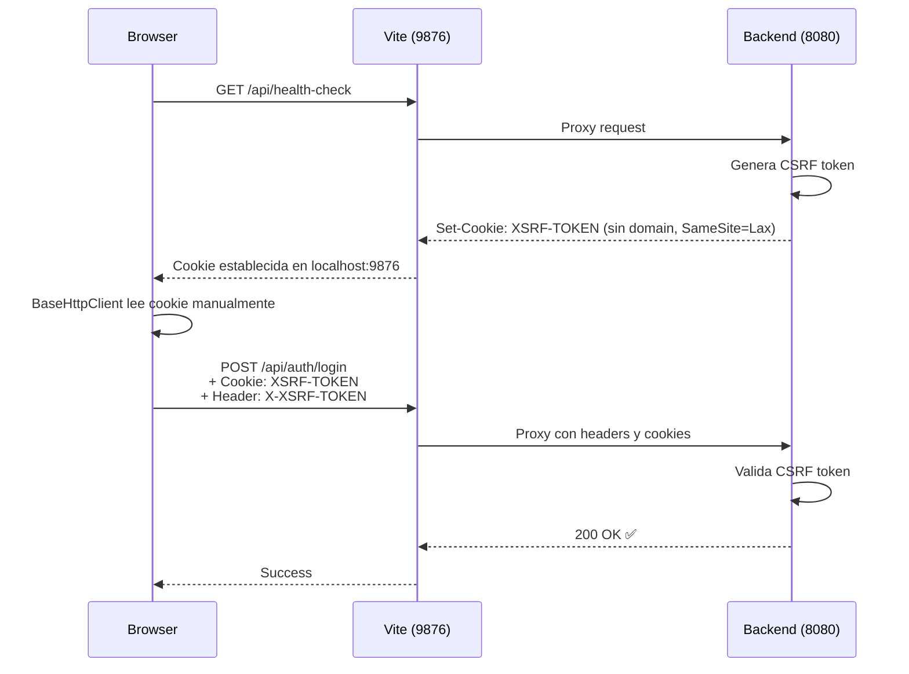

# Login Flow Diagram

This diagram describes the user login process in the SaaS authentication system. The flow starts with the Vue.js login form, which sends credentials and a CSRF token to the Spring Boot backend. The backend validates the CSRF token and credentials, then delegates authentication to Keycloak. If authentication succeeds, the backend issues a JWT and returns a 200 response. The frontend updates the Pinia store and redirects the user to the dashboard. Errors such as invalid credentials or CSRF failures are handled with appropriate status codes and error messages.

