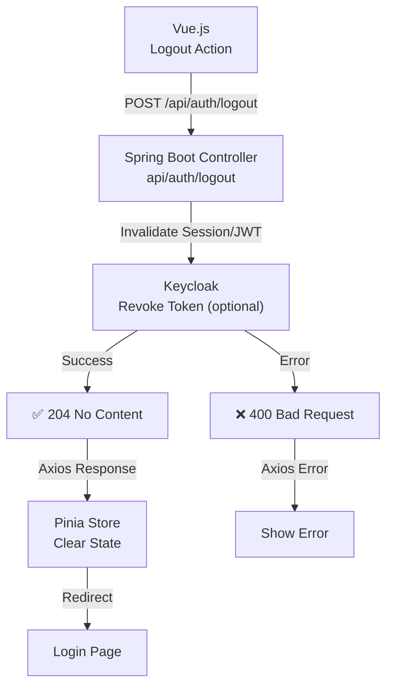

# Logout Flow Diagram

This diagram explains the user logout process in the SaaS authentication system. The flow starts when the user triggers a logout action in the frontend, which sends a POST request to the Spring Boot backend. The backend invalidates the user's session or JWT, optionally notifies Keycloak to revoke tokens, and returns a 204 No Content response. The frontend clears the Pinia store and redirects the user to the login page. Any errors are handled with appropriate status codes and error messages.

