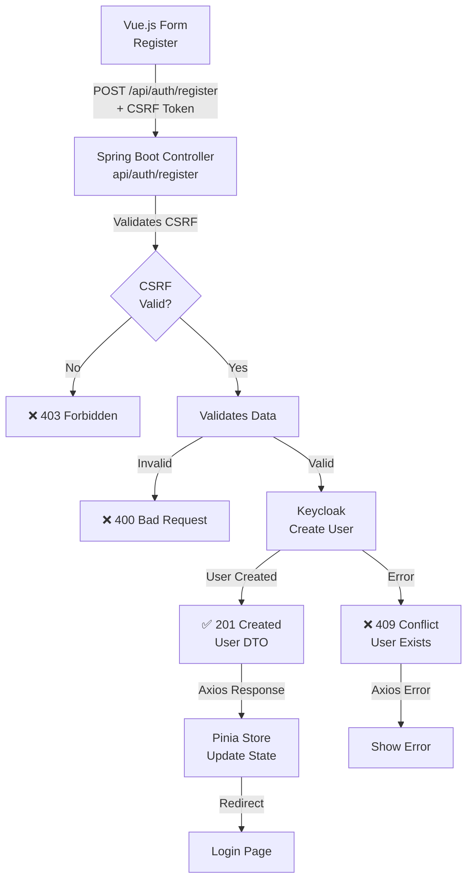

# Registration Flow Diagram

This diagram illustrates the user registration process in the SaaS authentication system. The flow begins with a Vue.js registration form, which submits user data and a CSRF token to the Spring Boot backend. The backend validates the CSRF token and the input data. If validation passes, it attempts to create a new user in Keycloak. Success results in a 201 response and updates the frontend state, redirecting the user to the login page. Errors such as invalid data or existing users are handled with appropriate HTTP status codes and frontend error displays.

