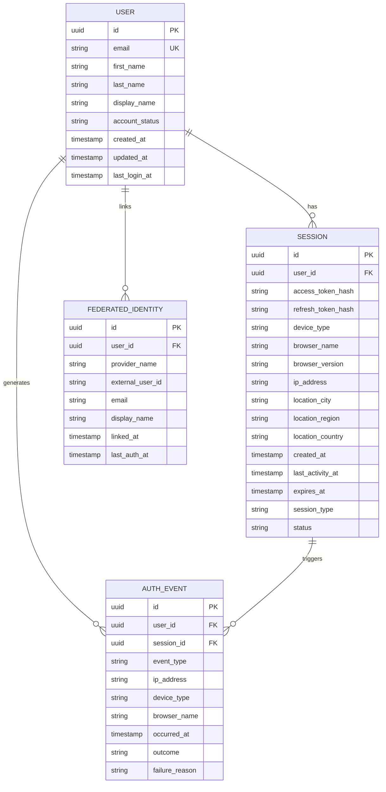

# Data Model: Secure Authentication System

**Feature**: 001-user-auth-system | **Date**: October 20, 2025
**Purpose**: Define all entities, relationships, validation rules, and state transitions

## Overview

This document defines the data model for the authentication system following Domain-Driven Design principles. All entities are defined as immutable value objects with explicit validation rules. The model supports both local email/password authentication and federated identity providers.

## Entity Relationship Diagram



---

## 1. User Entity

### Description

Represents a person with an account in the system. Users can authenticate via email/password credentials or federated identity providers. Each user has a profile, authentication status, and role assignments.

### Properties

| Property        | Type          | Constraints                 | Description                                              |
| --------------- | ------------- | --------------------------- | -------------------------------------------------------- |
| `id`            | UUID          | PK, NOT NULL                | Unique identifier (UUID v4)                              |
| `email`         | Email         | UK, NOT NULL, max 255 chars | Email address (unique, validated format)                 |
| `firstName`     | String        | NOT NULL, 2-100 chars       | User's first name                                        |
| `lastName`      | String        | NOT NULL, 2-100 chars       | User's last name                                         |
| `displayName`   | String        | NULLABLE, max 200 chars     | Optional display name (defaults to "firstName lastName") |
| `accountStatus` | AccountStatus | NOT NULL, default ACTIVE    | Account status enum                                      |
| `createdAt`     | Timestamp     | NOT NULL, default NOW()     | Account creation timestamp (UTC)                         |
| `updatedAt`     | Timestamp     | NOT NULL, default NOW()     | Last profile update timestamp (UTC)                      |
| `lastLoginAt`   | Timestamp     | NULLABLE                    | Last successful authentication timestamp (UTC)           |

### Enumerations

**AccountStatus**:

- `ACTIVE`: Account is active and can authenticate
- `DISABLED`: Account temporarily disabled (by admin or user)
- `SUSPENDED`: Account suspended due to security concerns
- `PENDING_VERIFICATION`: Email verification pending (future enhancement)

### Validation Rules

- **FR-001, FR-002**: Email must be valid format (RFC 5322) and unique
- **FR-004**: Cannot register with existing email address
- Email validation regex: `^[a-zA-Z0-9._%+-]+@[a-zA-Z0-9.-]+\.[a-zA-Z]{2,}$`
- First name and last name must contain only letters, spaces, hyphens, and apostrophes
- Display name defaults to `"${firstName} ${lastName}"` if not provided

### State Transitions

```
[NEW] -> PENDING_VERIFICATION -> ACTIVE
                                   ↓
                                DISABLED
                                   ↓
                                SUSPENDED
```

- **NEW → ACTIVE**: User completes registration (auto-transition for now, future: email verification)
- **ACTIVE → DISABLED**: User or admin disables account
- **ACTIVE → SUSPENDED**: System suspends account (e.g., after security incident)
- **DISABLED → ACTIVE**: User or admin reactivates account
- **SUSPENDED → ACTIVE**: Admin reviews and reactivates account

### Relationships

- **One-to-Many** with Session: A user can have multiple active sessions
- **One-to-Many** with AuthEvent: A user generates multiple authentication events
- **One-to-Many** with FederatedIdentity: A user can link multiple identity providers

### Example (JSON representation)

```json
{
  "id": "550e8400-e29b-41d4-a716-446655440000",
  "email": "jane.doe@example.com",
  "firstName": "Jane",
  "lastName": "Doe",
  "displayName": "Jane Doe",
  "accountStatus": "ACTIVE",
  "createdAt": "2025-10-20T10:30:00Z",
  "updatedAt": "2025-10-20T10:30:00Z",
  "lastLoginAt": "2025-10-20T14:15:00Z"
}
```

---

## 2. Session Entity

### Description

Represents an active user session associated with a specific device and browser. Sessions contain access/refresh tokens (hashed), device metadata, location information, and activity timestamps. Users can view and manage their sessions through the session management panel.

### Properties

| Property           | Type          | Constraints                   | Description                               |
| ------------------ | ------------- | ----------------------------- | ----------------------------------------- |
| `id`               | UUID          | PK, NOT NULL                  | Unique session identifier (UUID v4)       |
| `userId`           | UUID          | FK, NOT NULL, indexed         | Reference to User                         |
| `accessTokenHash`  | String        | NOT NULL, 64 chars            | SHA-256 hash of access token              |
| `refreshTokenHash` | String        | NOT NULL, 64 chars            | SHA-256 hash of refresh token             |
| `deviceType`       | DeviceType    | NULLABLE                      | Device type enum (parsed from User-Agent) |
| `browserName`      | String        | NULLABLE, max 100 chars       | Browser name (e.g., "Chrome", "Firefox")  |
| `browserVersion`   | String        | NULLABLE, max 50 chars        | Browser version (e.g., "118.0.5993.90")   |
| `ipAddress`        | String        | NOT NULL, max 45 chars        | IPv4 or IPv6 address                      |
| `locationCity`     | String        | NULLABLE, max 100 chars       | Approximate city (from IP geolocation)    |
| `locationRegion`   | String        | NULLABLE, max 100 chars       | State/province (from IP geolocation)      |
| `locationCountry`  | String        | NULLABLE, 2 chars             | ISO 3166-1 alpha-2 country code           |
| `createdAt`        | Timestamp     | NOT NULL, default NOW()       | Session creation timestamp (UTC)          |
| `lastActivityAt`   | Timestamp     | NOT NULL, updated on activity | Last API request timestamp (UTC)          |
| `expiresAt`        | Timestamp     | NOT NULL, indexed             | Session expiration timestamp (UTC)        |
| `sessionType`      | SessionType   | NOT NULL, default STANDARD    | Session type enum                         |
| `status`           | SessionStatus | NOT NULL, default ACTIVE      | Session status enum                       |

### Enumerations

**DeviceType**:

- `DESKTOP`: Desktop or laptop computer
- `MOBILE`: Smartphone
- `TABLET`: Tablet device
- `UNKNOWN`: Cannot determine device type

**SessionType**:

- `STANDARD`: Normal session (expires after 1 hour of inactivity)
- `REMEMBER_ME`: Persistent session (expires after 30 days)

**SessionStatus**:

- `ACTIVE`: Session is valid and active
- `EXPIRED`: Session expired naturally
- `REVOKED`: Session terminated by user (logout or session management)

### Validation Rules

- **FR-010**: Tokens must be hashed (SHA-256) before storage, never plaintext
- **FR-014, FR-015**: Logout must revoke session and clear tokens
- **FR-021**: Session expiration based on type (1 hour standard, 30 days remember me)
- **FR-032**: Session metadata must include device, browser, and location
- Access token hash length exactly 64 characters (SHA-256 hex)
- Refresh token hash length exactly 64 characters (SHA-256 hex)
- IP address must be valid IPv4 or IPv6 format

### State Transitions

```
[NEW] -> ACTIVE -> EXPIRED
           ↓
        REVOKED
```

- **NEW → ACTIVE**: Session created after successful authentication
- **ACTIVE → EXPIRED**: Session reaches `expiresAt` timestamp
- **ACTIVE → REVOKED**: User logs out or terminates session via session management

### Relationships

- **Many-to-One** with User: Multiple sessions belong to one user
- **One-to-Many** with AuthEvent: A session generates multiple authentication events

### Row-Level Security (RLS)

- **Policy**: Users can only query their own sessions (`session.userId = current_user_id`)
- **Enforcement**: PostgreSQL RLS policy at database level
- **Security**: Defense in depth against application-level filtering bugs

### Example (JSON representation)

```json
{
  "id": "7c9e6679-7425-40de-944b-e07fc1f90ae7",
  "userId": "550e8400-e29b-41d4-a716-446655440000",
  "accessTokenHash": "a3c0f6e1b8d9e4f2c5a7b9d1e3f5c7a9b1d3e5f7c9a1b3d5e7f9c1a3b5d7e9f1",
  "refreshTokenHash": "b4d1f7e2c9d0f5e3c6a8b0d2e4f6c8a0b2d4e6f8c0a2b4d6e8f0c2a4b6d8e0f2",
  "deviceType": "DESKTOP",
  "browserName": "Chrome",
  "browserVersion": "118.0.5993.90",
  "ipAddress": "203.0.113.42",
  "locationCity": "San Francisco",
  "locationRegion": "California",
  "locationCountry": "US",
  "createdAt": "2025-10-20T14:15:00Z",
  "lastActivityAt": "2025-10-20T15:42:18Z",
  "expiresAt": "2025-10-20T16:15:00Z",
  "sessionType": "STANDARD",
  "status": "ACTIVE"
}
```

---

## 3. AuthEvent Entity

### Description

Represents a security-relevant authentication operation for auditing and monitoring. Events are immutable records of authentication attempts, successes, failures, logouts, token operations, and session terminations. Used for security analysis, anomaly detection, and compliance reporting.

### Properties

| Property        | Type         | Constraints                      | Description                                        |
| --------------- | ------------ | -------------------------------- | -------------------------------------------------- |
| `id`            | UUID         | PK, NOT NULL                     | Unique event identifier (UUID v4)                  |
| `userId`        | UUID         | FK, NULLABLE, indexed            | Reference to User (null for failed registration)   |
| `sessionId`     | UUID         | FK, NULLABLE, indexed            | Reference to Session (null for pre-session events) |
| `eventType`     | EventType    | NOT NULL, indexed                | Event type enum                                    |
| `ipAddress`     | String       | NOT NULL, max 45 chars           | IPv4 or IPv6 address where event originated        |
| `deviceType`    | DeviceType   | NULLABLE                         | Device type (parsed from User-Agent)               |
| `browserName`   | String       | NULLABLE, max 100 chars          | Browser name                                       |
| `occurredAt`    | Timestamp    | NOT NULL, indexed, default NOW() | Event timestamp (UTC)                              |
| `outcome`       | EventOutcome | NOT NULL                         | Event outcome enum (success/failure)               |
| `failureReason` | String       | NULLABLE, max 500 chars          | Human-readable failure reason (for failed events)  |

### Enumerations

**EventType**:

- `LOGIN_SUCCESS`: Successful login with email/password
- `LOGIN_FAILURE`: Failed login attempt (wrong credentials)
- `FEDERATED_LOGIN_SUCCESS`: Successful OAuth provider login
- `FEDERATED_LOGIN_FAILURE`: Failed OAuth provider login
- `LOGOUT`: User initiated logout
- `REGISTRATION_SUCCESS`: New account created
- `REGISTRATION_FAILURE`: Registration attempt failed (e.g., duplicate email)
- `TOKEN_REFRESH_SUCCESS`: Access token refreshed successfully
- `TOKEN_REFRESH_FAILURE`: Token refresh failed (expired/invalid)
- `SESSION_TERMINATED`: Session terminated via session management
- `PASSWORD_RESET_REQUESTED`: Password reset flow initiated
- `RATE_LIMIT_EXCEEDED`: Authentication rate limit triggered

**EventOutcome**:

- `SUCCESS`: Event completed successfully
- `FAILURE`: Event failed

### Validation Rules

- **FR-029**: All authentication events must be logged
- **FR-030**: Rate limiting violations must generate events
- Events are immutable (insert-only, no updates or deletes)
- `failureReason` required when `outcome = FAILURE`
- `userId` null for events before user creation (e.g., failed registration)
- Retention period: minimum 90 days (Assumption 14)

### Relationships

- **Many-to-One** with User: Multiple events belong to one user
- **Many-to-One** with Session: Multiple events reference one session

### Indexes

- Composite index on `(userId, occurredAt DESC)` for user activity timeline
- Index on `eventType` for event type filtering
- Index on `occurredAt` for time-range queries
- Index on `outcome` for failure analysis

### Example (JSON representation)

```json
{
  "id": "9b2c3d4e-5f6a-7b8c-9d0e-1f2a3b4c5d6e",
  "userId": "550e8400-e29b-41d4-a716-446655440000",
  "sessionId": "7c9e6679-7425-40de-944b-e07fc1f90ae7",
  "eventType": "LOGIN_SUCCESS",
  "ipAddress": "203.0.113.42",
  "deviceType": "DESKTOP",
  "browserName": "Chrome",
  "occurredAt": "2025-10-20T14:15:00Z",
  "outcome": "SUCCESS",
  "failureReason": null
}
```

---

## 4. FederatedIdentity Entity

### Description

Represents a link between a user account and an external OAuth/OIDC identity provider (Google, Microsoft, GitHub, etc.). Enables federated authentication and account linking. Multiple providers can be linked to a single user account.

### Properties

| Property         | Type         | Constraints               | Description                                    |
| ---------------- | ------------ | ------------------------- | ---------------------------------------------- |
| `id`             | UUID         | PK, NOT NULL              | Unique link identifier (UUID v4)               |
| `userId`         | UUID         | FK, NOT NULL, indexed     | Reference to User                              |
| `providerName`   | ProviderName | NOT NULL                  | Identity provider enum                         |
| `externalUserId` | String       | NOT NULL, max 255 chars   | User ID from provider (e.g., Google sub claim) |
| `email`          | Email        | NOT NULL, max 255 chars   | Email from provider                            |
| `displayName`    | String       | NULLABLE, max 200 chars   | Display name from provider                     |
| `linkedAt`       | Timestamp    | NOT NULL, default NOW()   | Timestamp when link was created (UTC)          |
| `lastAuthAt`     | Timestamp    | NOT NULL, updated on auth | Last authentication via this provider (UTC)    |

### Enumerations

**ProviderName**:

- `GOOGLE`: Google OAuth2
- `MICROSOFT`: Microsoft Azure AD / Entra ID
- `GITHUB`: GitHub OAuth2
- `CUSTOM`: Custom OIDC provider (future extension)

### Validation Rules

- **FR-006, FR-024**: Support OAuth2/OIDC federated providers
- **FR-025**: Link federated accounts to existing users via email matching
- Composite unique constraint on `(userId, providerName)` - one link per provider per user
- Composite unique constraint on `(providerName, externalUserId)` - provider IDs are unique
- External user ID format validated per provider (e.g., Google sub is numeric string)

### Account Linking Logic

1. User authenticates via federated provider
2. System retrieves `email` from provider
3. If user with matching email exists: Link federated identity to existing user
4. If no match: Create new user account with federated identity
5. Store provider profile data for display and audit

### Relationships

- **Many-to-One** with User: Multiple federated identities can link to one user

### Indexes

- Composite unique index on `(userId, providerName)` to prevent duplicate links
- Composite unique index on `(providerName, externalUserId)` to ensure provider ID uniqueness

### Example (JSON representation)

```json
{
  "id": "1a2b3c4d-5e6f-7a8b-9c0d-1e2f3a4b5c6d",
  "userId": "550e8400-e29b-41d4-a716-446655440000",
  "providerName": "GOOGLE",
  "externalUserId": "1234567890987654321",
  "email": "jane.doe@gmail.com",
  "displayName": "Jane Doe",
  "linkedAt": "2025-10-15T09:20:00Z",
  "lastAuthAt": "2025-10-20T14:15:00Z"
}
```

---

## Database Indexes

### Primary Performance Indexes

```sql
-- Users
CREATE INDEX idx_users_email ON users (email);
CREATE INDEX idx_users_status ON users (account_status);

-- Sessions
CREATE INDEX idx_sessions_user_id ON sessions (user_id);
CREATE INDEX idx_sessions_status ON sessions (status);
CREATE INDEX idx_sessions_expires_at ON sessions (expires_at);
CREATE INDEX idx_sessions_user_status ON sessions (user_id, status); -- Composite for active session queries

-- AuthEvents
CREATE INDEX idx_auth_events_user_id ON auth_events (user_id);
CREATE INDEX idx_auth_events_session_id ON auth_events (session_id);
CREATE INDEX idx_auth_events_type ON auth_events (event_type);
CREATE INDEX idx_auth_events_occurred_at ON auth_events (occurred_at DESC);
CREATE INDEX idx_auth_events_user_time ON auth_events (user_id, occurred_at DESC); -- Composite for user timeline

-- FederatedIdentities
CREATE UNIQUE INDEX idx_federated_user_provider ON federated_identities (user_id, provider_name);
CREATE UNIQUE INDEX idx_federated_provider_external ON federated_identities (provider_name, external_user_id);
```

### Rationale

- **Foreign key indexes**: Optimize JOIN operations and CASCADE deletes
- **Status columns**: Enable efficient filtering of active/revoked sessions
- **Timestamp columns**: Support time-range queries and expiration cleanup
- **Composite indexes**: Optimize common query patterns (user's active sessions, user event timeline)
- **Unique indexes**: Enforce business constraints at database level

---

## Data Model Validation

### Compliance with Functional Requirements

- ✅ **FR-001**: User entity supports email/password registration
- ✅ **FR-004**: Email unique constraint prevents duplicate registrations
- ✅ **FR-006**: FederatedIdentity entity supports OAuth providers
- ✅ **FR-010**: Session entity stores access/refresh tokens (hashed)
- ✅ **FR-014, FR-015**: Session status supports revocation
- ✅ **FR-029**: AuthEvent entity logs all authentication operations
- ✅ **FR-031-FR-038**: Session entity supports multi-device management
- ✅ **Assumption 1**: Integration with Keycloak (backend handles via admin client)
- ✅ **Assumption 8**: Email uniqueness enforced at database level
- ✅ **Assumption 10**: Session revocation per device supported

### Performance Targets

- **SC-007**: 1000 concurrent auth requests supported via connection pooling and indexed queries
- **SC-016**: Session list query <3s via `idx_sessions_user_status` composite index
- **SC-017**: Remote session termination <5s via direct session update

### Security Compliance

- UUID primary keys prevent ID enumeration
- Token hashing (SHA-256) prevents plaintext exposure
- Row-Level Security (RLS) on sessions enforces user isolation
- Immutable audit events provide tamper-proof log
- Indexed foreign keys enable efficient CASCADE operations

---

## Next Steps

With the data model defined, we can now:

1. Generate API contracts (OpenAPI specifications)
2. Create Liquibase database migrations
3. Implement domain entities in Kotlin and TypeScript
4. Write repository interfaces and tests
5. Build command/query handlers

**Phase 1 Complete**: Data model documented and validated. Ready for contract generation.
